# Hard Real-Time en Rust: guía introductoria

Esta guía presenta una introducción práctica al desarrollo de sistemas **Hard Real-Time (HRT) con Rust**, partiendo de los conceptos fundamentales necesarios para comprender qué hace que un sistema pueda cumplir requisitos temporales estrictos. A lo largo del contenido se exploran principios como el determinismo temporal, los *deadlines*, el WCET y la gestión predecible de recursos, así como las principales alternativas disponibles en Rust para construir este tipo de sistemas. El recorrido abarca desde microcontroladores y entornos `no_std`, incluyendo enfoques como bare-metal, RTOS, RTIC y Embassy, hasta sistemas basados en Linux, donde se estudian herramientas y tecnologías como PREEMPT_RT, las políticas de planificación real-time, RoboPLC y Xenomai. Finalmente, se presentan algunas librerías y estrategias que permiten integrar estas herramientas dentro de arquitecturas reales, con el objetivo de ofrecer una visión general y accesible del ecosistema Hard Real-Time en Rust.

# ¿Qué es Hard Real Time?

Antes de hablar de **Hard Real-Time (HRT)**, es importante entender qué significa que un sistema sea **de tiempo real**.

En un sistema de tiempo real, no basta con que el resultado de una operación sea correcto; también debe producirse **en el momento adecuado**. En otras palabras, la corrección del sistema depende tanto del resultado obtenido como del tiempo empleado para obtenerlo [[1]](#ref-1).

> [!IMPORTANT]
>
> **Tiempo real no significa simplemente “muy rápido”.**
>
> Un sistema puede ejecutar una tarea en pocos microsegundos y aun así no ser adecuado para tiempo real si no puede garantizar cuánto tardará en responder. En este contexto, la **predictibilidad** es más importante que alcanzar la mayor velocidad posible.

Para cada operación crítica suele establecerse un **deadline**, es decir, un límite temporal antes del cual la tarea debe haber terminado.

Por ejemplo, si un controlador debe responder a un evento en un máximo de `2 ms`, existen dos posibles situaciones:

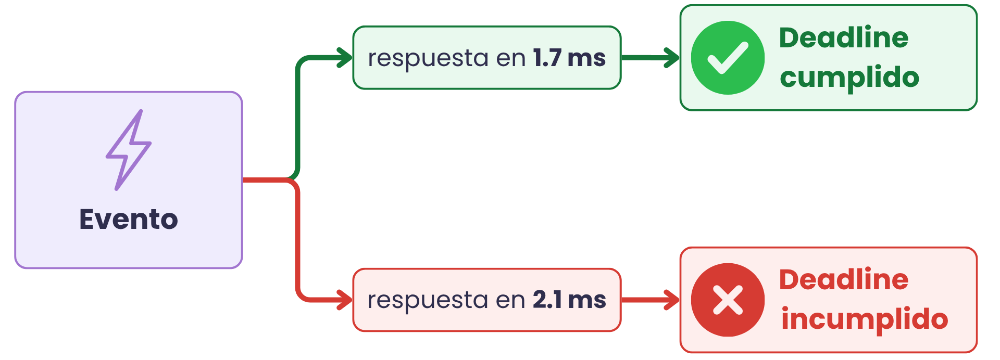

La importancia de ese incumplimiento depende del tipo de sistema de tiempo real que se esté implementando.

**Hard Real-Time**

En un sistema **Hard Real-Time** (HRT), los *deadlines* asociados a las tareas críticas deben cumplirse siempre. Si una de estas tareas termina después del tiempo establecido, se considera que el sistema ha fallado [[1]](#ref-1), [[2]](#ref-2).

Por esta razón, el objetivo no consiste únicamente en conseguir una **latencia baja**, sino en garantizar que el **peor tiempo de respuesta posible permanezca dentro del límite permitido**.

Algunos ejemplos habituales aparecen en sistemas como:

- control de vuelo
- sistemas de frenado y control automotriz
- dispositivos médicos
- control industrial
- sistemas aeroespaciales

Esta necesidad de garantizar tiempos máximos de ejecución introduce conceptos como **determinismo temporal**, **latencia**, **WCET (*Worst-Case Execution Time*)**, prioridades e interrupciones. Estos conceptos serán importantes más adelante para entender qué herramientas ofrece Rust para construir sistemas con requisitos de tiempo real.

# Fundamentos de Hard Real-Time en Rust

Rust, por su naturaleza, proporciona varias características especialmente útiles para construir sistemas con requisitos temporales estrictos: ausencia de *garbage collector*, control explícito sobre la memoria, abstracciones de coste reducido y un sistema de tipos orientado a prevenir numerosos errores de memoria y concurrencia. Sin embargo, **utilizar Rust no convierte automáticamente un programa en Hard Real-Time**.

Para considerar que un sistema cumple requisitos HRT, todo el conjunto (hardware, sistema operativo o runtime, planificación de tareas y aplicación) debe permitir analizar y garantizar sus tiempos de respuesta.

> [!IMPORTANT]
> 
> 
> **Hard Real-Time es una propiedad del sistema completo, no del lenguaje de programación.** Rust puede facilitar la construcción de software determinista, pero no puede garantizar por sí solo que se cumpla un *deadline*.
> 

## ¿Qué necesita un sistema HRT?

Aunque los requisitos concretos dependen de la aplicación, existen varios principios recurrentes, como el determinismo temporal, uso de memoria de manera predecible, latencia de interrupciones acotada y ausencia de *garbage collector*. Estos principios se explorarán a continuación. 

### Determinismo temporal

El sistema debe permitir establecer límites sobre cuánto puede tardar una operación crítica. Uno de los conceptos utilizados para este análisis es el **WCET (*Worst-Case Execution Time*)**, que representa una cota del tiempo máximo que puede requerir una tarea.

No basta, por tanto, con conocer cuánto tarda una tarea **en promedio**. Para analizar un sistema HRT conviene distinguir tres conceptos:

| Concepto | Pregunta que responde |
| --- | --- |
| **Tiempo promedio** | ¿Cuánto tarda normalmente la tarea? |
| **WCET** | ¿Cuánto podría tardar como máximo? |
| **Deadline** | ¿Cuánto tiempo tiene permitido tardar? |

> [!IMPORTANT]
> 
> 
> En Hard Real-Time, el valor más relevante no es cuánto tarda una tarea normalmente, sino si puede garantizarse que **incluso en el peor caso terminará antes de su deadline**.
> 

De forma simplificada, el requisito temporal puede expresarse como:

**WCET + interferencias del sistema ≤ Deadline**

Las **interferencias del sistema** pueden incluir, entre otras, interrupciones, ejecución de tareas de mayor prioridad, cambios de contexto o actividad introducida por el sistema operativo.

Por ejemplo, una tarea podría tener un WCET de `1.5 ms` y sufrir hasta `0.3 ms` de interferencia. Si su deadline es de `2 ms`, el peor tiempo de respuesta estimado sería de `1.8 ms`, por lo que todavía existiría un margen de `0.2 ms`.

### Memoria predecible

Las operaciones de memoria utilizadas dentro de rutas críticas deben tener un comportamiento temporal suficientemente conocido. Por esta razón, muchos sistemas HRT evitan o restringen la **asignación dinámica de memoria durante la ejecución**, especialmente en tareas críticas.

La reserva dinámica mediante un *heap* puede introducir problemas como:

- tiempos variables de asignación
- fragmentación
- fallos de asignación
- mayor dificultad para establecer límites temporales

En sistemas embebidos es frecuente reservar la memoria de las tareas de forma estática antes de comenzar la operación normal.

> [!NOTE]
> 
> 
> HRT no significa necesariamente que esté **prohibido usar memoria dinámica (*heap*)**.
> 
> Lo importante es que las operaciones que intervienen en una ruta temporal crítica tengan tiempos y consumo de memoria suficientemente acotados. En sistemas particularmente estrictos, evitar la asignación dinámica suele ser la opción más sencilla de analizar.
> 

### Latencia de interrupciones acotada

Cuando ocurre un evento crítico —por ejemplo, un sensor detecta una condición peligrosa— el procesador debe poder comenzar a atenderlo dentro de un intervalo conocido.

Por ello son importantes factores como:

- prioridad de las interrupciones
- duración de las ISR (*Interrupt Service Routines*)
- tiempo durante el cual las interrupciones permanecen deshabilitadas
- interferencia producida por otras tareas
- latencia introducida por el sistema operativo

### Ausencia de Garbage Collector

Rust no utiliza un *garbage collector* para gestionar la memoria. En su lugar, utiliza principalmente su modelo de **ownership**, *borrowing* y tiempos de vida para determinar cuándo pueden liberarse los recursos. Esto resulta especialmente interesante para sistemas de tiempo real porque evita pausas introducidas por ciclos impredecibles de recolección de basura.

Sin embargo, **que el lenguaje no use un *garbage collector* no equivale a que el tiempo es determinista**, ya que pueden existir otras fuentes de variabilidad, como asignación dinámica, interrupciones, bloqueos, acceso a dispositivos, cachés o planificación realizada por un sistema operativo.

---

# HRT puede existir en diferentes tipos de dispositivos

Al hablar de Hard Real-Time con Rust es fácil pensar exclusivamente en microcontroladores. Sin embargo, los requisitos HRT pueden aparecer en plataformas muy diferentes.

Una primera clasificación útil es la que se muestra en la imagen:

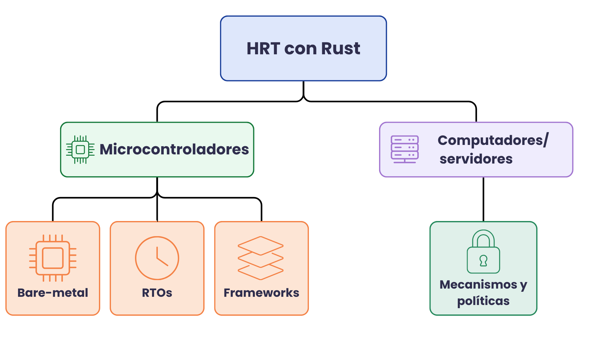

A continuación, se explicaran cada uno de estos componentes; desde los microcontroladores hasta la parte de servidores. 

## Microcontroladores

Un **microcontrolador** es un pequeño sistema de cómputo integrado en un único chip. Normalmente reúne en el mismo dispositivo:

- Una **CPU**, encargada de ejecutar instrucciones
- **Memoria**, donde se almacenan el programa y los datos
- **Periféricos**, como temporizadores, GPIO, UART, SPI, I²C o ADC
- Mecanismos de **interrupción**, que permiten reaccionar rápidamente ante eventos externos

A diferencia de un computador de propósito general, un microcontrolador suele estar diseñado para realizar un conjunto de tareas muy concretas dentro de un sistema físico. Por ejemplo, puede utilizarse para leer la temperatura de un sensor, controlar la velocidad de un motor, activar una válvula o gestionar un sistema de frenado. 

Los microcontroladores son especialmente comunes en aplicaciones HRT porque permiten trabajar **muy cerca del hardware**. Esto reduce la cantidad de capas intermedias entre el programa y los periféricos y, en consecuencia, facilita el análisis de cuánto puede tardar una operación.

Sobre un microcontrolador pueden utilizarse diferentes modelos de desarrollo. Los más importantes para esta guía son:

- **Bare-metal**, ejecutando el programa directamente sobre el hardware
- **RTOS**, utilizando un sistema operativo de tiempo real
- **Frameworks de Rust**, como RTIC o Embassy, que proporcionan modelos propios para organizar tareas, concurrencia y temporización

Cada enfoque ofrece un equilibrio diferente entre control, complejidad y facilidad de desarrollo.

### `std` y `no_std`

Para entender cómo se desarrolla Rust sobre microcontroladores, conviene distinguir primero entre **`std`** y **`no_std`**

#### La biblioteca estándar `std`

En un programa convencional de Rust, la biblioteca estándar **`std`** ofrece muchas funcionalidades que dependen de servicios proporcionados por un sistema operativo.

Por ejemplo:

| Módulo | ¿Para qué se utiliza? |
| --- | --- |
| `std::thread` | Crear y gestionar hilos de ejecución del sistema operativo. |
| `std::fs` | Leer, crear y modificar archivos. |
| `std::net` | Trabajar con conexiones de red, como TCP y UDP. |
| `std::process` | Crear y controlar otros procesos del sistema operativo. |

Estas funcionalidades son naturales cuando el programa se ejecuta sobre Linux, Windows o macOS, porque existe un sistema operativo encargado de ofrecer esos servicios.

Por ejemplo, un programa de escritorio podría utilizar:

```rust
use std::fs;

fn main() {
    let contenido = fs::read_to_string("datos.txt")
        .expect("No se pudo leer el archivo");

    println!("{contenido}");
}
```

Aquí `std::fs` puede utilizar el sistema de archivos porque el sistema operativo ya proporciona toda la infraestructura necesaria para abrir, leer y cerrar un archivo.

En un microcontrolador bare-metal, en cambio, normalmente no existe un sistema operativo completo que proporcione archivos, procesos, threads del sistema operativo, terminal estándar, sockets de red o llamadas al sistema convencionales.

Por ello, intentar utilizar directamente muchas funcionalidades de `std` simplemente no tendría sentido en ese entorno.

> [!NOTE]
> 
> 
> Un microcontrolador puede tener almacenamiento, red o concurrencia, pero estas capacidades se manejan mediante periféricos, drivers, frameworks o un RTOS, no necesariamente mediante las abstracciones de `std`.
> 

#### El entorno `no_std`

Rust permite desarrollar programas sin depender de la biblioteca estándar mediante el atributo `#![no_std]`. Este atributo se coloca normalmente al comienzo del archivo principal del programa.

Un ejemplo mínimo podría verse así:

```rust
#![no_std]
#![no_main]

use core::panic::PanicInfo;

#[panic_handler]
fn panic(_info: &PanicInfo) -> ! {
    loop {}
}
```

La primera línea (`#![no_std]`) indica al compilador que el programa **no debe enlazar automáticamente la biblioteca estándar `std`**. En su lugar, el programa continúa teniendo acceso a **`core`**, una biblioteca mucho más pequeña que contiene las funcionalidades fundamentales del lenguaje y que no depende de un sistema operativo [[3]](#ref-3).

Por ejemplo, incluso en `no_std` siguen estando disponibles elementos como:

- tipos primitivos (`u8`, `u32`, `bool`, etc.)
- `Option<T>`
- `Result<T, E>`
- slices
- referencias
- iteradores
- operaciones numéricas

Por tanto, `no_std` no significa que Rust quede reducido a unas pocas instrucciones básicas. Gran parte de las herramientas fundamentales del lenguaje siguen disponibles.

#### Aclaraciones importantes sobre `no_std`

Antes de continuar, conviene aclarar algunas ideas que suelen generar confusión al comenzar a trabajar con `no_std`. Utilizar este entorno cambia la forma en que un programa Rust accede a ciertas funcionalidades, pero no implica automáticamente la ausencia de memoria dinámica ni garantiza que el sistema tenga un comportamiento Hard Real-Time. Las siguientes preguntas permiten delimitar mejor qué significa trabajar con `no_std`, qué posibilidades ofrece y cuáles son sus principales ventajas en sistemas embebidos.


**1.¿`no_std` significa que no existe memoria dinámica (*heap*)?**

No necesariamente. Utilizar `#![no_std]` significa que el programa deja de depender de la biblioteca estándar `std`, pero **esto no implica automáticamente que el sistema no pueda utilizar memoria dinámica**.

En este tipo de entornos, Rust sigue proporcionando la biblioteca `core`, que contiene muchas de las funcionalidades fundamentales del lenguaje y no requiere soporte de un sistema operativo. Sin embargo, `core` por sí sola no incluye estructuras que dependan de asignación dinámica, como `Vec` , `String` y `Box` .

Para utilizar este tipo de estructuras en un programa `no_std`, Rust dispone del *crate* (o librería) **`alloc`**. Este *crate* puede utilizarse siempre que el sistema proporcione previamente un **allocator**, es decir, un mecanismo encargado de reservar y liberar memoria dentro del *heap* [[3]](#ref-3).

> [!NOTE]
Una forma sencilla de entenderlo es:
`core` proporciona las funcionalidades básicas del lenguaje.
`alloc` añade estructuras que necesitan memoria dinámica.
`std` incluye funcionalidades de más alto nivel que normalmente dependen de un sistema operativo.
> 

La siguiente imagen resume esta relación:

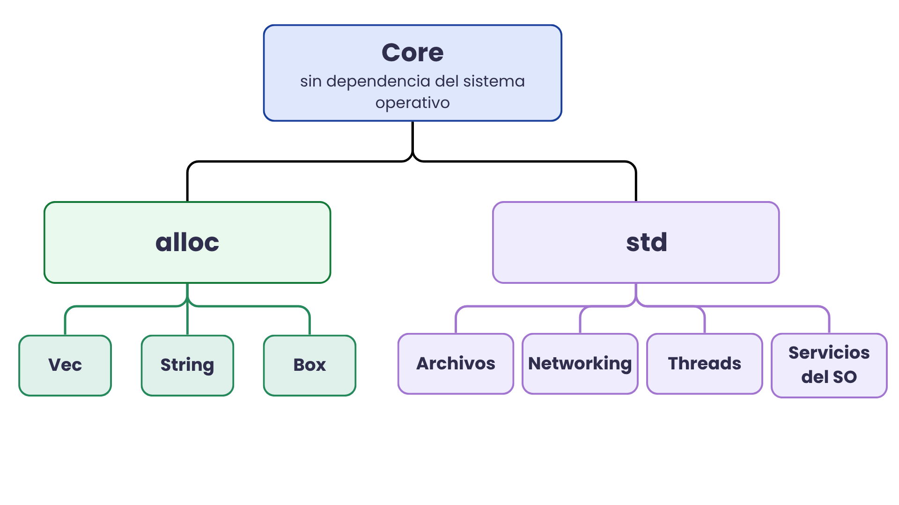

En la imagen, `core` aparece como la base común. A partir de esta pueden utilizarse dos capas adicionales:

- **`alloc`**, que permite acceder a estructuras como `Vec`, `String` y `Box` cuando existe un allocator disponible.
- **`std`**, que proporciona funcionalidades como archivos, networking, threads y otros servicios asociados normalmente a un sistema operativo.

La idea principal es que **`no_std` elimina la dependencia de `std`, pero no prohíbe por sí mismo el uso del heap**.

**2. ¿`no_std` significa HRT?**

Tampoco. `#![no_std]` únicamente indica que el programa no depende de la biblioteca estándar de Rust [[3]](#ref-3).

Es posible escribir un programa en el entorno `no_std` que tenga un comportamiento no determinista, así como un programa usando el entorno `std` cuyo diseño sea pensado para tiempo real. 

> [!IMPORTANT]
> 
> 
> `no_std` debe entenderse como una **herramienta para trabajar sin las abstracciones de un sistema operativo convencional**, no como una certificación de Hard Real-Time.
> 

**3. ¿Qué ventajas ofrece `no_std` en sistemas embebidos?**

Aunque no garantiza HRT, resulta especialmente útil cuando se requiere control cercano al hardware, por tanto las ventajas que ofrece son:

**a. Control sobre la memoria y el runtime**

El desarrollador puede decidir con mayor precisión:

- qué memoria se reserva
- dónde se almacena
- qué ocurre durante el arranque
- cómo se manejan los errores y *panics*
- qué código forma parte del runtime

Los binarios `no_std`, por ejemplo, deben proporcionar su propio manejo de *panic* cuando no existe la infraestructura proporcionada normalmente por `std` [[3]](#ref-3).

**b. Acceso directo al hardware**

En sistemas embebidos, el software necesita comunicarse constantemente con componentes físicos como sensores, temporizadores, puertos de comunicación o pines de entrada y salida.

Una de las formas más comunes de hacerlo es mediante **Memory-Mapped I/O (MMIO)**.

En este modelo, algunos recursos del hardware se representan como **direcciones específicas dentro del espacio de memoria del microcontrolador**. Esto permite que el procesador acceda a un periférico de forma similar a como accedería a una posición de memoria.

Por ejemplo, un registro asociado a un pin GPIO (General-Purpose Input/Output) puede encontrarse en una dirección concreta. Al leer o modificar el valor almacenado en esa dirección, el programa puede consultar el estado del pin o cambiar su salida.

La siguiente imagen muestra esta idea de forma simplificada:

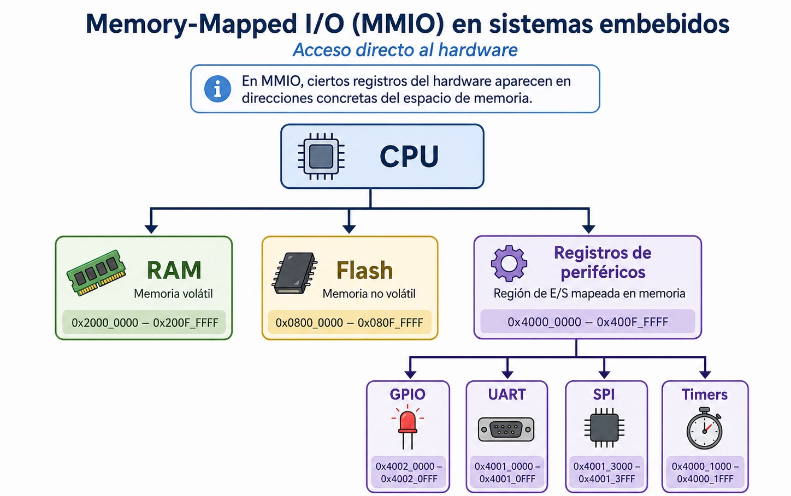

En la imagen, la CPU comparte un mismo espacio de direcciones con diferentes regiones:

- **RAM**, utilizada para almacenar datos temporales durante la ejecución.
- **Flash**, donde normalmente se almacena el programa y datos persistentes.
- **Registros de periféricos**, que permiten controlar directamente componentes como:
    - `GPIO`, para entradas y salidas digitales;
    - `UART`, para comunicación serial;
    - `SPI`, para comunicación con periféricos externos;
    - `Timers`, para medición y generación precisa de intervalos de tiempo.

La idea clave es que estos periféricos pueden controlarse leyendo o escribiendo en sus registros correspondientes; sin embargo, acceder directamente a direcciones de memoria puede ser propenso a errores. Por esta razón, en Rust suelen utilizarse capas **HAL (*Hardware Abstraction Layer*)**.

Una HAL proporciona una interfaz de más alto nivel sobre esos registros. En lugar de manipular manualmente direcciones y bits, el desarrollador puede trabajar con tipos y métodos más seguros y expresivos.

Conceptualmente, la relación puede entenderse así:

**Aplicación Rust → HAL → Registros del periférico → Hardware**

Este nivel de control es especialmente relevante en sistemas HRT, ya que permite conocer con mayor precisión qué operaciones se realizan sobre el hardware y reducir capas intermedias que podrían introducir latencias difíciles de predecir.

**c. Control de la distribución de memoria**

En entornos **bare-metal**, el programa se ejecuta directamente sobre el hardware, por lo que no existe un sistema operativo encargado de decidir cómo se organiza la memoria. Por esta razón, el desarrollador debe tener un mayor control sobre **dónde se ubica cada parte del programa**.

Una de las herramientas que permite lograrlo es el **linker script**.

Un *linker script* es un archivo de configuración que le indica al enlazador (*linker*) cómo debe distribuir las distintas secciones del programa dentro del mapa de memoria del microcontrolador. En otras palabras, permite especificar qué partes deben colocarse en **Flash** (memoria no volátil) y cuáles deben colocarse en **RAM** (memoria volátil).

La siguiente imagen resume esta idea de forma simplificada a través de un ejemplo:

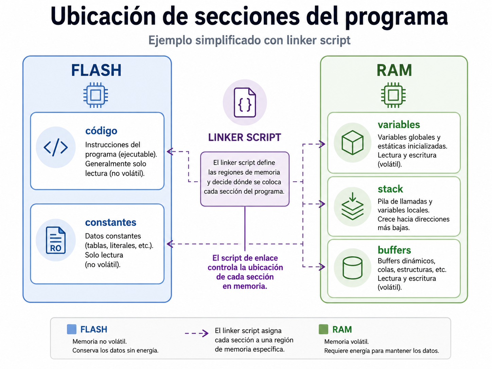

La idea principal es que el *linker script* actúa como un plano que le dice al compilador y al enlazador **qué sección del programa debe ir en qué región de memoria**. Este control resulta especialmente importante en sistemas embebidos porque los microcontroladores suelen tener cantidades de memoria limitadas y con funciones muy concretas.

**d. Targets específicos**

Cuando se compila un programa en Rust, el compilador necesita saber **para qué tipo de procesador y entorno debe generar el código máquina**. Esa información se define mediante un **target**.

Un target describe la plataforma objetivo sobre la cual se ejecutará el programa. Dependiendo del caso, puede incluir información sobre:

- la **arquitectura del procesador**
- el **sistema operativo** o la ausencia de este
- la **ABI (*Application Binary Interface*)** utilizada
- determinadas capacidades o convenciones propias de la plataforma.

Por ejemplo, un target común en microcontroladores ARM Cortex-M es `thumbv7em-none-eabi`. Este nombre puede dividirse, de forma simplificada, en varias partes

| Componente | Significado |
| --- | --- |
| `thumbv7em` | Indica la arquitectura y el conjunto de instrucciones ARM Thumb correspondiente a ciertos procesadores Cortex-M. |
| `none` | Indica que no existe un sistema operativo convencional como Linux o Windows. |
| `eabi` | Indica la ABI utilizada para definir aspectos como llamadas a funciones, uso de registros y representación de datos. |

La **ABI** establece una serie de reglas para que distintas partes del programa puedan comunicarse correctamente a nivel binario. Por ejemplo, define cómo se pasan parámetros a una función, dónde se guarda su valor de retorno o qué registros debe preservar una llamada.

Por tanto, seleccionar un target adecuado permite que Rust genere código compatible con el procesador y el entorno reales del dispositivo.

Rust dispone de múltiples targets bare-metal para familias ARM y otras arquitecturas [[4]](#ref-4).

> [!IMPORTANT]
> 
> 
> El target debe coincidir con las características reales del hardware. Elegir un target incorrecto puede generar código incompatible con el procesador o asumir características que el dispositivo no posee.
> 

En sistemas embebidos, esta selección es especialmente importante porque el programa suele compilarse en un computador diferente al dispositivo donde finalmente se ejecutará. Este proceso se conoce como **cross-compilation**.

> [!NOTE]
> 
> 
> Elegir un target específico permite generar código adecuado para ese procesador, pero **no hace que su tiempo de ejecución sea matemáticamente predecible por sí mismo**. La predictibilidad debe analizarse considerando también el hardware y el software ejecutado.
> 

### Bare-metal

En un sistema **bare-metal**, el programa se ejecuta directamente sobre el hardware, sin un sistema operativo convencional entre ambos.

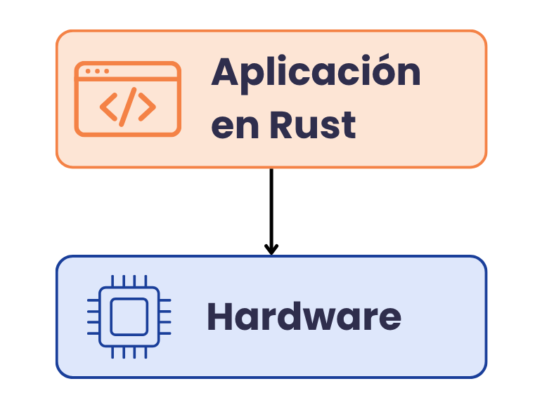

Esto proporciona un elevado grado de control sobre:

- interrupciones
- periféricos
- memoria
- inicio del programa
- planificación de tareas

La contrapartida es que la propia aplicación debe encargarse de gran parte de estas responsabilidades.

En este punto, cabe resaltar que `no_std` y bare-metal no son lo mismo, ya que aunque suelen aparecer juntos, es importante no confundir ambos conceptos. **Bare-metal** describe **dónde se ejecuta el programa**: directamente sobre el hardware, sin un sistema operativo convencional. `no_std`, en cambio, describe **qué biblioteca de Rust utiliza el programa**: el programa no depende de `std`. En microcontroladores, es muy común encontrar **Bare-metal con `no_std` ,** pero conceptualmente no son sinonimos. 

### RTOS

Otra posibilidad consiste en utilizar un **RTOS (*Real-Time Operating System*)**. Este operaría como una capa intermedia entre la aplicación y el hardware.

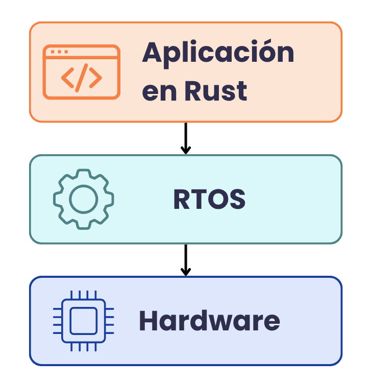

Un RTOS proporciona mecanismos como:

- tareas o *threads*
- prioridades
- temporizadores
- sincronización
- comunicación entre tareas
- planificación temporal

El desarrollador trabaja entonces sobre las primitivas proporcionadas por ese sistema operativo.

Esta opción es habitual cuando existe un RTOS compatible con el microcontrolador o cuando el proyecto necesita integrarse con un ecosistema ya existente.

### Frameworks orientados a Rust

Rust también dispone de soluciones que no siguen necesariamente el modelo clásico de un RTOS con un kernel encargado de gestionar todas las tareas.

Dos de las más importantes son **RTIC** y **Embassy**. Ambos ayudan a organizar tareas concurrentes en sistemas embebidos, pero utilizan modelos de ejecución diferentes.

No obstante, antes de explicar el modelo de cada uno de ellos, es relevante comprender los componentes que se encargan de ejecutar las tareas.

#### Scheduler y Executor: ejecución de tareas

Al comenzar a trabajar con RTOS, RTIC o Embassy aparecen dos términos que pueden resultar confusos: **scheduler** y **executor**. Ambos ayudan a gestionar múltiples tareas, pero pertenecen a modelos de ejecución diferentes.

**Scheduler**

Un **scheduler** —o planificador— decide qué tarea tiene derecho a utilizar el procesador en un momento determinado.

Un RTOS tradicional suele utilizar tareas con prioridades:

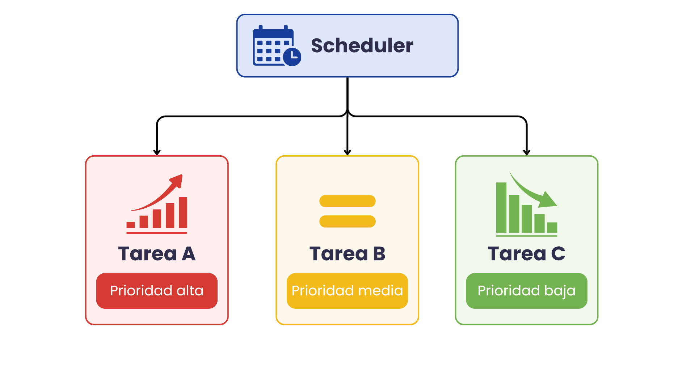

La imagen representa un scheduler que administra varias tareas con distintos niveles de prioridad. La Tarea A tiene prioridad alta, la Tarea B prioridad media y la Tarea C prioridad baja. El scheduler utiliza estas prioridades para decidir cuál de las tareas debe obtener el procesador en cada momento.

En un sistema **basado en interrupciones**, una tarea de mayor prioridad puede interrumpir a una de menor prioridad.

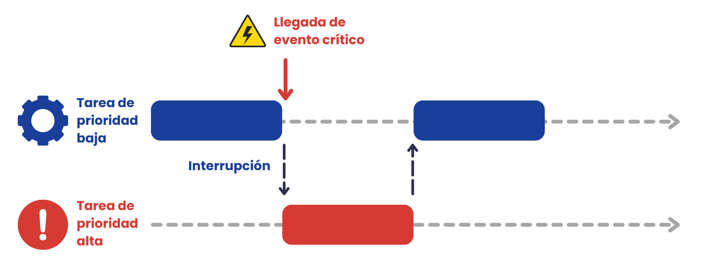

El cambio entre tareas puede requerir guardar y restaurar el contexto de ejecución del procesador, lo que se conoce como **context switch**.

Los RTOS tradicionales suelen mantener además un *stack* (pila)independiente para cada thread o tarea.

**Executor**

Un **executor** es el componente encargado de ejecutar y reanudar tareas asíncronas.

Este modelo aparece en Rust con `async` y `.await` . 

Una función `async` puede suspender su ejecución cuando alcanza un punto `.await`.

Conceptualmente:

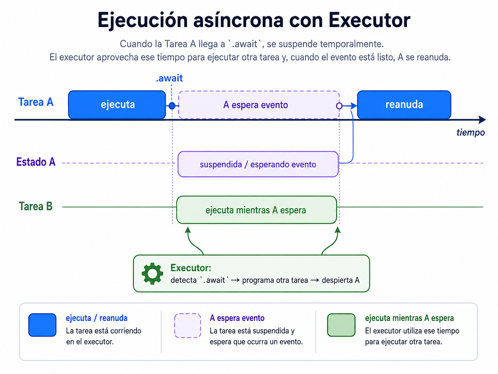

En lugar de mantener necesariamente un thread completo para cada operación concurrente, las funciones `async` se transforman en **máquinas de estados**.

Esto puede reducir considerablemente el coste de memoria asociado a mantener numerosos stacks independientes.

**Scheduler vs executor**

Una comparación inicial entre los dos esquemas se muestra en la siguiente tabla:

|  | Scheduler | Executor |
| --- | --- | --- |
| **Pregunta principal** | ¿Qué tarea debe utilizar la CPU? | ¿Qué tarea async está lista para continuar? |
| **Común en** | RTOS, kernels, RTIC | runtimes `async`, Embassy |
| **Unidad típica** | Thread / tarea | Future / tarea async |
| **Cambio de ejecución** | Puede involucrar interrupción forzada de una tarea y cambio de contexto | Normalmente ocurre cuando una Future se suspende o despierta |
| **Memoria** | Habitualmente un stack por thread | Estado de la Future almacenado como máquina de estados |
| **Prioridades** | Habituales | También pueden existir |

> [!TIP]
> 
> 
> Por ahora basta con conservar esta idea:
> 
> **Scheduler:** decide *quién obtiene el procesador*.
> 
> **Executor:** hace avanzar las tareas `async` que están listas para ejecutarse.
> 
> Posteriormente, RTIC y Embassy mostrarán dos formas diferentes de resolver este mismo problema de concurrencia y temporización.
> 

#### *Real-Time Interrupt-driven Concurrency* (RTIC)

RTIC (*Real-Time Interrupt-driven Concurrency*) es un **framework de concurrencia para sistemas de tiempo real**. En microcontroladores ARM Cortex-M, puede aprovechar mecanismos del propio hardware —como el **NVIC (*Nested Vectored Interrupt Controller*)**— para gestionar prioridades y decidir qué tarea debe ejecutarse [[5]](#ref-5). 

Lo anterior quiere decir que, en RTIC, muchas tareas se organizan alrededor de **eventos e interrupciones del hardware,** de manera que, cuando ocurre un evento importante, el microcontrolador puede interrumpir una tarea menos prioritaria y comenzar a ejecutar otra de mayor prioridad.

El **NVIC** es una parte del microcontrolador encargada de administrar las interrupciones. Entre otras cosas, permite asignarles prioridades y decidir cuál debe atenderse primero.

Por ejemplo, puede imaginarse un sistema con dos eventos:

- un sensor de temperatura genera una lectura periódica
- un sensor de seguridad detecta una condición crítica.

Si el evento de seguridad tiene mayor prioridad, RTIC puede aprovechar el mecanismo de interrupciones del propio procesador para atenderlo antes que la tarea de temperatura.

De forma simplificada, el flujo puede representarse como:

**Evento crítico → Interrupción → Prioridad alta → Ejecución inmediata de la tarea**

Esto permite que parte de la planificación no dependa de un kernel de software tradicional, sino de mecanismos ya disponibles en el hardware.

RTIC resulta especialmente interesante cuando se necesitan:

- Prioridades estrictas
- Respuesta rápida ante interrupciones
- Acceso controlado a recursos compartidos
- Comportamiento temporal predecible
- Bajo consumo de memoria

#### Embassy

Embassy adopta un enfoque diferente. Proporciona un **executor `async/await` diseñado específicamente para sistemas embebidos**, con tareas cuya memoria puede asignarse estáticamente [[6]](#ref-6).

En este modelo, las tareas no necesitan ejecutarse continuamente ni bloquear el procesador mientras esperan que ocurra algo.

Por ejemplo, una tarea podría esperar a que expire un temporizador o que llegue un paquete por red, y mientras esa tarea está esperando, el executor puede utilizar el procesador para ejecutar otra.

El **executor** es el componente encargado de saber qué tareas están listas para continuar y ejecutarlas cuando corresponde.

Una forma sencilla de visualizarlo sería:

**Tarea espera → libera el procesador → otra tarea se ejecuta → ocurre el evento → la primera tarea continúa**

Esto permite manejar muchas operaciones concurrentes sin necesitar necesariamente un thread y un stack completo para cada una.

#### Dos modelos diferentes para resolver un problema similar

RTIC y Embassy intentan resolver un problema común: **cómo organizar múltiples tareas sin perder control sobre el tiempo y los recursos del sistema**.

La diferencia principal está en el modelo que utilizan:

|  | **RTIC** | **Embassy** |
| --- | --- | --- |
| **Idea principal** | Tareas dirigidas por eventos e interrupciones | Tareas asíncronas que esperan eventos |
| **Mecanismo central** | Prioridades e interrupciones | `async/await` + executor |
| **Forma intuitiva de verlo** | “Ocurrió algo importante: atiéndelo según su prioridad” | “Esta tarea está esperando: ejecuta otra mientras tanto” |
| **Planificación** | Muy ligada a mecanismos del hardware | Gestionada principalmente por un executor |
| **Modelo de concurrencia** | Basado en tareas y prioridades | Basado en *Futures* y tareas async |

> [!IMPORTANT]
> 
> 
> Ninguno de los dos frameworks convierte automáticamente una aplicación en Hard Real-Time. Ambos proporcionan herramientas para construir sistemas con comportamiento temporal controlado, pero sigue siendo necesario analizar prioridades, WCET, interrupciones, memoria y deadlines.
> 

## Computadores y servidores

Hasta ahora, gran parte del desarrollo Hard Real-Time se ha planteado desde sistemas embebidos, donde frameworks como RTIC o Embassy controlan de forma bastante directa la ejecución sobre un microcontrolador, pero en un servidor o computador, el escenario cambia.

Rust continúa aportando propiedades muy valiosas, como **seguridad de memoria, ausencia de Garbage Collector, abstracciones de concurrencia seguras y buen control sobre los recursos**, pero las garantías temporales no dependen únicamente del lenguaje.

En este entorno, el comportamiento real-time surge de la combinación de varias capas:

| Capa | Responsabilidad | Opciones habituales |
| --- | --- | --- |
| Aplicación | Algoritmos de control, procesamiento y lógica de negocio | Rust |
| Runtime | Hilos, tareas, temporizadores e I/O | `std::thread`, Tokio, RoboPLC |
| API del sistema | Prioridades, afinidad, memoria y planificación | `libc`, `nix`, `rustix` |
| Kernel | Planificación, interrupciones y apropiación de la CPU por el planificador | Políticas del sistema operativo |
| Hardware | Interrupciones, cachés, buses, frecuencia de CPU | Plataforma utilizada |
| Medición | Comprobar latencia, *jitter* (variación temporal) y deadlines | `cyclictest`, `rt-tests`, ftrace, perf |

Por esta razón, instalar Rust sobre un sistema operativo **no convierte automáticamente una aplicación en Hard Real-Time**. El kernel, los drivers, las interrupciones, el hardware y la propia arquitectura de la aplicación siguen formando parte del análisis temporal.

En esta guía, el análisis se centrará principalmente en servidores y computadores que utilizan Linux, ya que este sistema operativo ofrece mecanismos específicos para aplicaciones de tiempo real, como políticas de planificación real-time, afinidad de CPU y soporte mediante PREEMPT_RT, además de contar con un amplio ecosistema de herramientas compatibles con Rust.

Un sistema Linux convencional utiliza normalmente políticas orientadas a repartir el procesador de manera justa entre las tareas. Estas políticas son adecuadas para servidores, escritorios y aplicaciones generales, pero no están diseñadas para garantizar que una tarea determinada comience a ejecutarse dentro de un intervalo temporal estricto.

Para cargas real-time, Linux ofrece políticas específicas como `SCHED_FIFO`, `SCHED_RR` y `SCHED_DEADLINE` .  En Linux, una **política de planificación** (*scheduling policy*) define **cómo decide el kernel qué hilo debe usar la CPU en cada momento**. En aplicaciones convencionales, el objetivo suele ser repartir el procesador de manera justa; en tiempo real, en cambio, interesa que las tareas críticas puedan ejecutarse con una prioridad y un comportamiento temporal más predecibles.

También existe **PREEMPT_RT** que, por su parte, no es una política de planificación, sino una modificación del propio kernel Linux orientada a hacerlo más **interrumpible y predecible**. Su objetivo es reducir el tiempo durante el cual una tarea de alta prioridad debe esperar porque el kernel está ejecutando código que no puede ser interrumpido. En otras palabras, las políticas determinan **quién debería ejecutar**, mientras que PREEMPT_RT ayuda a que el kernel pueda **ceder la CPU a esa tarea crítica con menor latencia**. [[7]](#ref-7), [[8]](#ref-8). Desde Linux 6.12, el soporte principal de PREEMPT_RT forma parte oficialmente del kernel Linux.

En los próximos apartados se presentarán las principales herramientas y enfoques disponibles en Linux para construir sistemas con requisitos de tiempo real. Se explicará el papel de PREEMPT_RT, las políticas de planificación real-time y soluciones de más alto nivel como RoboPLC y Xenomai, mostrando cómo cada una contribuye a mejorar el control sobre la ejecución y la predictibilidad temporal del sistema.

---

### Linux PREEMPT_RT

**PREEMPT_RT** es una de las principales herramientas para convertir Linux en una plataforma adecuada para aplicaciones de tiempo real.

En un kernel convencional existen secciones durante las cuales el kernel no puede ser interrumpido fácilmente por otra tarea. Si una tarea crítica aparece durante una de estas secciones, deberá esperar.

PREEMPT_RT modifica numerosos mecanismos internos del kernel para que una mayor cantidad de ellos puedan ser interrumpidos. Entre otras cosas, convierte determinados locks en mecanismos compatibles con *priority inheritance*[[7]](#ref-7). Esto significa que, si una tarea de baja prioridad posee un recurso que necesita una tarea de mayor prioridad, la tarea de baja prioridad puede heredar temporalmente una prioridad más alta para liberar ese recurso cuanto antes.

Además, muchas interrupciones pasan a ejecutarse como **hilos del kernel administrados por el scheduler**. En lugar de que toda la atención de la interrupción ocurra fuera del control normal del planificador, estas interrupciones pueden recibir prioridades y competir por CPU de forma más controlada, lo que facilita reducir y analizar su interferencia sobre las tareas real-time.

El efecto buscado puede representarse así:

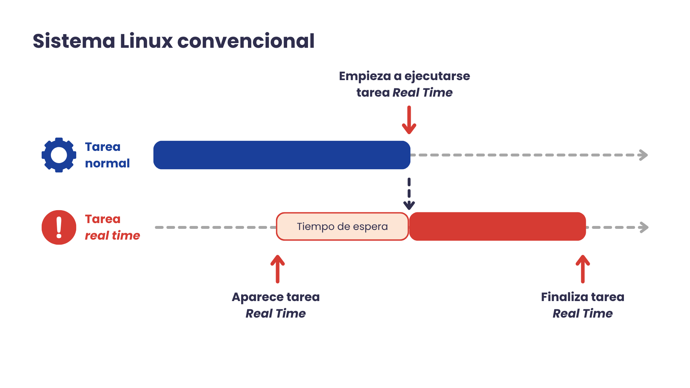
En Linux convencional, una tarea real-time puede volverse ejecutable mientras una tarea normal todavía ocupa la CPU. Durante ese intervalo, la tarea real-time debe esperar hasta que el sistema pueda cederle el procesador, generando una determinada latencia de scheduling.

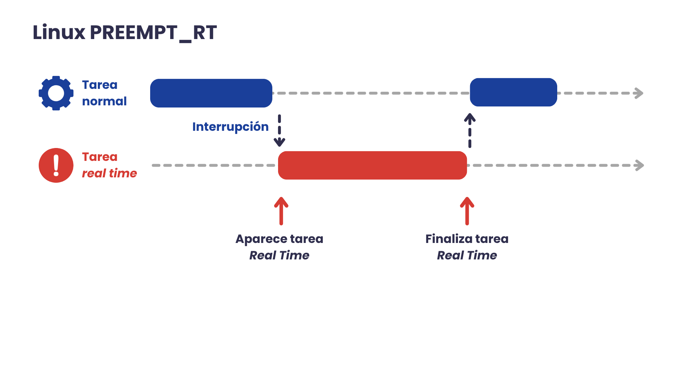
Con PREEMPT_RT, el kernel está diseñado para permitir que la tarea real-time desplace con mayor rapidez a la tarea normal. De esta forma, se reduce el intervalo entre el momento en que la tarea real-time queda lista para ejecutarse y el momento en que realmente obtiene la CPU.

La consecuencia principal es una reducción de la **latencia de scheduling**: el tiempo transcurrido entre que una tarea real-time se vuelve ejecutable y el momento en que realmente obtiene CPU.

> [!NOTE]
> 
> 
> PREEMPT_RT no convierte todos los tiempos de Linux en constantes. Hardware, firmware, drivers, buses, cachés, interrupciones y diseño de software todavía pueden introducir *jitter* (variación temporal).
> 

---

### Políticas de planificación real-time

PREEMPT_RT suele utilizarse junto con alguna de las políticas de planificación real-time de Linux. A continuación, se explican tres de ellas. 

#### `SCHED_FIFO`

`SCHED_FIFO` implementa planificación por **prioridad fija**. Esto quiere decir que una tarea de mayor prioridad puede desplazar a una de menor prioridad.

Por ejemplo:

| Prioridad | Tarea |
| --- | --- |
| **80** | Control del motor |
| **60** | Lectura de sensores |
| **20** | Telemetría |

En este caso, **Control del motor** es la tarea más prioritaria, mientras que **Telemetría** es la menos prioritaria.

Si la tarea de prioridad 80 se vuelve ejecutable mientras está ejecutándose la tarea de prioridad 20, Linux puede interrumpir la tarea de telemetría y ceder la CPU a la tarea de mayor prioridad.

Entre tareas `SCHED_FIFO` con la misma prioridad no existe un *time slice* periódico, es decir, un intervalo de tiempo fijo tras el cual el sistema obliga a una tarea a ceder la CPU para que otra de igual prioridad pueda ejecutarse. A diferencia de `SCHED_RR`, una tarea `SCHED_FIFO` normalmente continúa ejecutándose hasta que:

- se bloquea,
- termina,
- cede voluntariamente el procesador,
- o aparece una tarea de mayor prioridad.

> [!WARNING]
> 
> 
> Una tarea `SCHED_FIFO` mal diseñada puede monopolizar un CPU e incluso dificultar seriamente la operación del sistema. Las prioridades deben diseñarse como parte del análisis de viabilidad temporal y no simplemente configurarse “lo más altas posible”.
> 

---

#### `SCHED_RR`

`SCHED_RR` —*Round Robin*— utiliza también prioridades real-time, pero cuando varias tareas tienen la **misma prioridad**, reparte la CPU entre ellas en **intervalos de tiempo limitados**. A cada uno de estos intervalos se le llama *quantum*: cuando una tarea consume su intervalo, debe ceder la CPU para que otra tarea de igual prioridad pueda ejecutarse.

Por ejemplo:

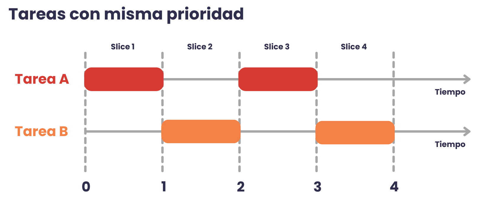

Cuando existen varias tareas de igual prioridad, el procesador va rotando entre ellas.

#### `SCHED_DEADLINE`

Existe una tercera alternativa especialmente interesante: **`SCHED_DEADLINE`**.

En lugar de asignar únicamente una prioridad fija, cada tarea se describe mediante tres parámetros temporales:

| Parámetro | Significado |
| --- | --- |
| **`runtime`** | Cantidad máxima de tiempo de CPU que la tarea puede utilizar dentro de cada periodo. |
| **`deadline`** | Tiempo límite dentro del cual la tarea debe completar su ejecución. |
| **`period`** | Intervalo con el que la tarea vuelve a activarse o recibe nuevamente tiempo de CPU. |

Por ejemplo:

| Parámetro | Valor |
| --- | --- |
| `runtime` | 2 ms |
| `deadline` | 10 ms |
| `period` | 10 ms |

Esto significa que la tarea puede usar hasta **2 ms de CPU**, debe terminar antes de que transcurran **10 ms**, y este patrón se repite cada **10 ms**.

> [!NOTE]
> 
> 
> Una forma sencilla de verlo es: `runtime` indica **cuánto tiempo puede ejecutar**, `deadline` indica **para cuándo debe terminar**, y `period` indica **cada cuánto se repite**.
> 

Linux implementa `SCHED_DEADLINE` combinando dos ideas principales: **Earliest Deadline First (EDF)** y **Constant Bandwidth Server (CBS)** [[8]](#ref-8).

**EDF** determina **qué tarea debe ejecutarse primero**. La regla es: entre las tareas listas para ejecutarse, se selecciona aquella cuyo *deadline* está más próximo.

Por ejemplo:

| Tarea | Deadline restante |
| --- | --- |
| Tarea A | 5 ms |
| Tarea B | 2 ms |
| Tarea C | 8 ms |

En este caso, el orden de ejecución sería:

**Tarea B → Tarea A → Tarea C**

porque la tarea B es la que tiene el límite de tiempo más cercano.

Por otro lado, **CBS** se encarga de controlar **cuánto tiempo de CPU puede consumir cada tarea**. Para ello utiliza el valor de `runtime` definido en `SCHED_DEADLINE`. Si una tarea consume todo su tiempo reservado antes de que termine su periodo, el kernel limita temporalmente su ejecución hasta que vuelva a disponer de presupuesto.

La combinación de ambos mecanismos permite que Linux no solo tenga en cuenta **qué tarea es más urgente**, sino también **cuánto tiempo de procesador puede utilizar cada una**. Por esta razón, `SCHED_DEADLINE` puede representar mejor cargas periódicas o esporádicas que una política basada únicamente en prioridades fijas.

#### Configuración habitual de un sistema PREEMPT_RT

La política de planificación (*scheduling*) es solo una parte de una configuración real-time. Para reducir interferencias y hacer el comportamiento del sistema más predecible, suelen combinarse varias técnicas:

| Técnica | ¿Qué hace? | ¿Por qué ayuda en HRT? |
| --- | --- | --- |
| **Afinidad de CPU** | Restringe un hilo para que se ejecute únicamente en uno o varios núcleos concretos. | Reduce migraciones entre CPUs y facilita controlar qué tareas compiten por el procesador. |
| **Aislamiento de CPUs** | Reserva determinados núcleos principalmente para tareas críticas. | Evita que servicios generales de Linux interfieran con los hilos real-time. |
| **Distribución de interrupciones** | Asigna interrupciones a CPUs específicos. | Permite mantener interrupciones no críticas alejadas de los núcleos dedicados a tareas HRT. |
| **Bloqueo de memoria** | Mantiene las páginas del proceso residentes en RAM mediante mecanismos como `mlockall()` [[14]](#ref-14). | Reduce el riesgo de *page faults* y accesos a swap durante una tarea crítica. |
| **Evitar operaciones impredecibles** | Limita operaciones como asignaciones dinámicas, I/O bloqueante, DNS, logging síncrono o creación de hilos dentro del camino crítico. | Evita introducir latencias difíciles de acotar. |

Es importante decir que estas técnicas no garantizan por sí solas el comportamiento Hard Real-Time. Su objetivo es **reducir fuentes de latencia e interferencia** para que los tiempos máximos de ejecución sean más fáciles de medir y controlar.

En general, una buena configuración PREEMPT_RT intenta **dedicar recursos a las tareas críticas, reducir interferencias externas y evitar operaciones cuyo tiempo de ejecución sea difícil de predecir**.

---

### RoboPLC - Aplicaciones Industriales

Configurar manualmente una aplicación real-time en Linux desde Rust es posible, pero implica trabajar directamente con varios mecanismos del sistema: creación de hilos, políticas de planificación, prioridades, afinidad de CPU, gestión de memoria, sincronización y APIs específicas de Linux. Este enfoque ofrece un control muy detallado, pero también aumenta la cantidad de configuración que debe realizar el desarrollador y exige conocer con bastante profundidad cómo Linux maneja las tareas real-time.

**RoboPLC** plantea una aproximación diferente: en lugar de construir toda esa infraestructura manualmente, proporciona un **framework de más alto nivel** orientado específicamente a aplicaciones industriales y de tiempo real en Linux. [[9]](#ref-9)

Su ecosistema incluye herramientas para trabajar con hilos real-time, controladores, workers, comunicación e I/O industrial [[9]](#ref-9). Por ejemplo, su módulo `thread_rt` proporciona una interfaz similar a los hilos convencionales de Rust, pero permite incorporar capacidades real-time propias de Linux.

Puede entenderse como una **capa de abstracción entre la aplicación y los mecanismos real-time de Linux**:

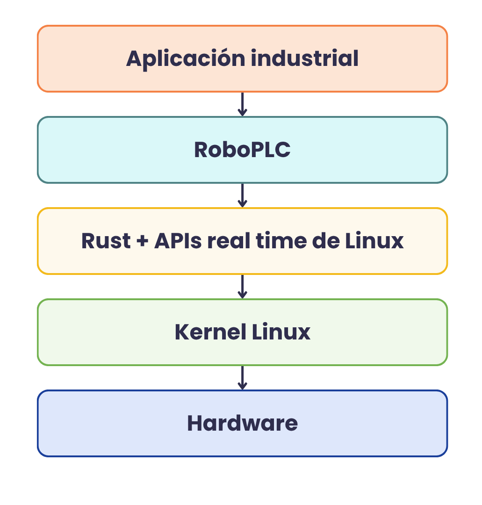

Cada nivel del diagrama cumple una función distinta:

- **Aplicación industrial:** contiene la lógica específica del sistema, como control de motores, adquisición de sensores, automatización o procesamiento de datos.
- **RoboPLC:** proporciona estructuras y herramientas que facilitan organizar tareas, hilos, comunicación y comportamiento real-time sin tener que configurar cada mecanismo del sistema operativo directamente.
- **Rust + APIs real-time de Linux:** es la capa donde finalmente se utilizan mecanismos como políticas de planificación, afinidad de CPU o primitivas de sincronización.
- **Kernel Linux:** continúa siendo quien realmente planifica los hilos, administra interrupciones y controla el acceso al hardware.
- **Hardware:** ejecuta finalmente las instrucciones y se comunica con sensores, actuadores, interfaces de red y otros dispositivos.

RoboPLC **no sustituye a PREEMPT_RT ni reemplaza al scheduler de Linux**. Su función es facilitar el desarrollo de aplicaciones que utilizan esas capacidades desde Rust. Por esta razón, RoboPLC **tampoco es un RTOS independiente**. Puede verse más bien como una capa que permite trabajar con las capacidades real-time de Linux mediante abstracciones más cercanas al ecosistema Rust.

RoboPLC también proporciona políticas específicas de locking y estructuras de comunicación diseñadas pensando en aplicaciones real-time.

> [!NOTE]
> 
> 
> RoboPLC resulta especialmente interesante cuando el sistema tiene una naturaleza industrial (PLC, robot, adquisición de datos o control) porque evita tener que construir manualmente toda la infraestructura Linux/Rust desde cero.
> 

---

### Xenomai

PREEMPT_RT intenta convertir Linux en un kernel con comportamiento mucho más predecible; sin embargo, existen aplicaciones en las que incluso esta solución puede no proporcionar una latencia suficientemente baja o estable. 
Para estos escenarios existe **Xenomai**, un framework de tiempo real diseñado para ejecutar aplicaciones con requisitos deterministas junto a Linux. Su objetivo es proporcionar servicios propios de un RTOS —como planificación de tareas, temporizadores, sincronización y APIs de tiempo real— sin renunciar al ecosistema completo de Linux para tareas no críticas, como red, almacenamiento o administración del sistema.

La idea central es separar, en mayor o menor medida, las actividades **temporalmente críticas** de las actividades convencionales del sistema. Linux puede seguir encargándose de las tareas generales, mientras que Xenomai proporciona un entorno específicamente diseñado para aquellas tareas cuyos tiempos de respuesta deben mantenerse bajo un control mucho más estricto.

Xenomai 3 permite implementar esta idea mediante **dos arquitecturas principales**, que difieren principalmente en cuánto dependen del propio kernel Linux para proporcionar el comportamiento real-time: **Cobalt** y **Mercury** [[10]](#ref-10):

| Modelo | Arquitectura | Idea principal |
| --- | --- | --- |
| **Cobalt** | Dual kernel | Añade un núcleo real-time que trabaja junto a Linux y se ocupa directamente de las actividades críticas. |
| **Mercury** | Single kernel | Utiliza el propio kernel Linux y sus capacidades de tiempo real, normalmente apoyándose en PREEMPT_RT cuando se requieren latencias más estrictas. |

#### Cobalt: arquitectura de doble kernel

Cobalt utiliza una arquitectura de **doble núcleo** (*dual-kernel*). Esto significa que, en la misma máquina, **Linux y un núcleo de tiempo real especializado trabajan de forma paralela**, cada uno atendiendo un tipo distinto de carga.

El **co-kernel Cobalt** se encarga de las tareas que requieren una respuesta temporal estricta, mientras que el kernel Linux continúa gestionando las actividades generales del sistema.

De forma simplificada:

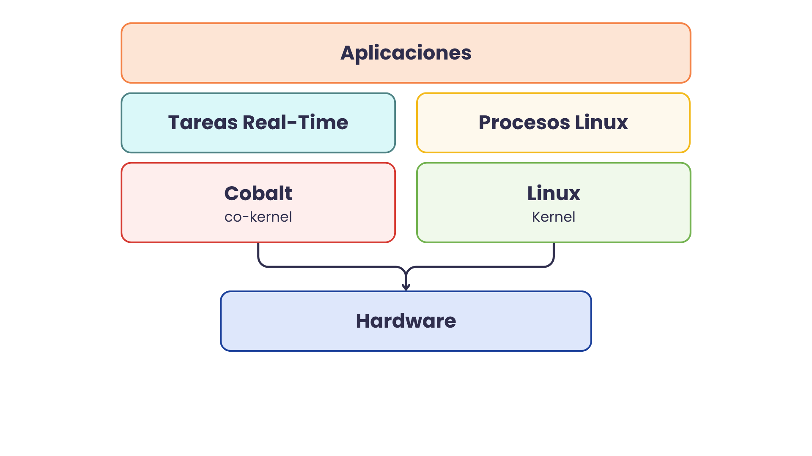

**Cobalt no sustituye completamente a Linux**. Ambos comparten el mismo hardware, pero Cobalt se coloca en una posición que le permite atender primero determinados eventos y tareas real-time. De esta manera, una actividad crítica no tiene que depender exclusivamente del scheduler convencional de Linux para obtener CPU.

Cobalt se ocupa de funciones como la **planificación de hilos real-time**, temporizadores y el manejo de determinadas interrupciones. Estas actividades pueden recibir prioridad sobre las operaciones normales del kernel Linux [[10]](#ref-10).

En una aplicación industrial, por ejemplo, Cobalt podría encargarse de **l**a **adquisición de un sensor crítico** o una **tarea periódica que debe ejecutarse cada cierto tiempo**. Al mismo tiempo, Linux podría continuar gestionando tareas menos sensibles al tiempo, como Ethernet, almacenamiento, SSH, interfaces gráficas o servicios de administración. Esto permite mantener Linux disponible para networking, archivos y administración sin hacer que todas las tareas críticas dependan directamente de su scheduler convencional.

#### Mercury: kernel único

Mercury utiliza un enfoque diferente al de Cobalt: **no añade un segundo núcleo de tiempo real**, sino que se ejecuta sobre el propio kernel Linux.

La arquitectura puede entenderse así:

![mercury.png]assets/(mercury.png)

En este modelo, las aplicaciones siguen utilizando las APIs de Xenomai, pero internamente estas se apoyan en los **hilos y mecanismos de planificación nativos de Linux**. Es decir, Xenomai proporciona una interfaz orientada a tiempo real, mientras que el kernel Linux continúa siendo quien realmente ejecuta y planifica las tareas.

Cuando se requieren latencias más bajas y predecibles, Mercury puede utilizarse junto con **PREEMPT_RT**, de modo que Linux tenga un comportamiento más adecuado para cargas real-time [[10]](#ref-10).

A diferencia de Cobalt, Mercury depende directamente del comportamiento del kernel Linux. Esto simplifica la arquitectura, pero también significa que sus garantías temporales están más ligadas a la configuración y capacidades de Linux.


#### Xenomai desde Rust

Aquí aparece una diferencia importante respecto a RoboPLC. Mientras que RoboPLC está pensado directamente para Rust, Xenomai expone principalmente **APIs escritas en C**, por lo que la integración desde Rust requiere una capa adicional de interoperabilidad.

Esa capa se conoce como **FFI** (*Foreign Function Interface*). Una FFI permite que un lenguaje invoque funciones escritas en otro; en este caso, permite que código Rust llame a las funciones proporcionadas por Xenomai en C.

De forma simplificada:

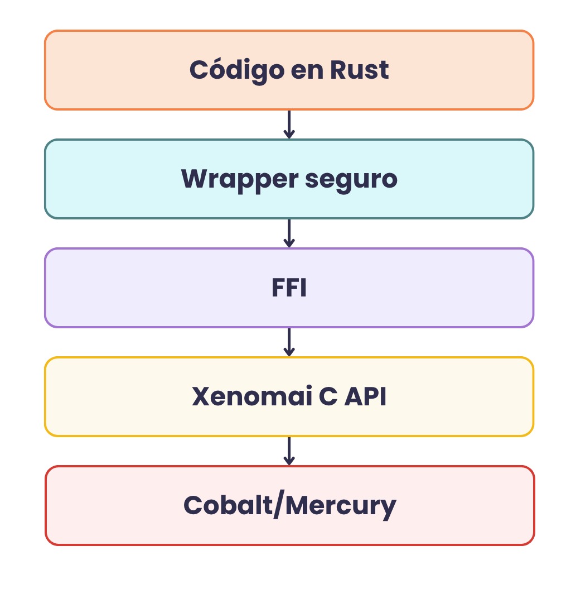

La imagen representa las capas necesarias para que una aplicación escrita en Rust pueda utilizar Xenomai. En la parte superior se encuentra el código Rust, que contiene la lógica principal de la aplicación. Este código accede a Xenomai a través de un wrapper seguro, es decir, una capa escrita en Rust que intenta ofrecer una interfaz cómoda y reducir al mínimo el uso directo de unsafe. Debajo se encuentra la FFI, que actúa como puente entre Rust y C. Esta capa traduce las llamadas realizadas desde Rust para que puedan invocar las funciones expuestas por la API de Xenomai escrita en C. Finalmente, esas funciones utilizan la infraestructura de tiempo real proporcionada por Cobalt o Mercury, dependiendo de la arquitectura de Xenomai empleada.

Para construir esta integración pueden utilizarse herramientas como `bindgen`, que genera automáticamente *bindings* de Rust a partir de cabeceras C. Esos *bindings* actúan como la representación en Rust de las funciones, tipos y constantes expuestas por Xenomai.

El principal reto no es que Rust no pueda utilizar Xenomai, sino que al atravesar la frontera FFI se pierden temporalmente algunas de las garantías que normalmente ofrece el compilador. Rust no puede verificar por sí solo que una función externa respete reglas como la validez de punteros, los tiempos de vida o el acceso correcto a memoria. Por esta razón, las llamadas FFI suelen requerir código `unsafe`.

Por ello, una práctica recomendable consiste en **concentrar el código `unsafe` en una capa pequeña y bien definida**, y exponer hacia el resto de la aplicación una interfaz segura:


De esta manera, la mayor parte de la aplicación puede seguir beneficiándose de las garantías normales de Rust, mientras que la interacción con Xenomai queda aislada en una capa pequeña, más fácil de revisar y verificar.

### ¿PREEMPT_RT o Xenomai?

Para elegir entre Linux estándar, PREEMPT_RT o una solución más especializada, conviene avanzar de forma progresiva. Primero debe evaluarse si **Linux estándar** ya cumple las *deadlines* y los límites de latencia requeridos por la aplicación. Si es así, no es necesario añadir complejidad adicional.

Si Linux estándar no es suficiente, el siguiente paso consistiría en probar **Linux con PREEMPT_RT**, junto con una configuración adecuada de prioridades, afinidad de CPU, memoria e interrupciones. Para muchas aplicaciones real-time en servidor, esta combinación puede proporcionar el nivel de predictibilidad necesario.

Solo si PREEMPT_RT sigue sin cumplir los requisitos temporales debería considerarse una arquitectura más especializada, como **Xenomai Cobalt**, un **RTOS** o incluso hardware dedicado.

> [!TIP]
> 
> 
> Para la mayoría de nuevos proyectos Linux real-time conviene evaluar **PREEMPT_RT primero**. Xenomai Cobalt introduce una arquitectura más compleja y suele justificarse cuando los requisitos temporales realmente necesitan esa complejidad adicional.
> 

### Opciones y librerías de Rust para servidores HRT

A diferencia de un microcontrolador, donde frameworks como RTIC o Embassy pueden organizar buena parte de la ejecución del sistema, una aplicación Linux real-time suele construirse combinando mecanismos proporcionados por el propio sistema operativo con distintas herramientas del ecosistema Rust.

En Rust, muchas de estas herramientas se distribuyen como ***crates***, equivalentes a librerías o paquetes en otros lenguajes. Estas pueden proporcionar acceso a APIs de Linux, creación y configuración de hilos, gestión de memoria, comunicación entre tareas o runtimes para operaciones que no requieren garantías temporales estrictas.

Las siguientes crates y APIs permiten construir las distintas partes de una aplicación real-time sobre Linux.


#### A. Hilos y prioridades

Para configurar hilos real-time desde Rust existen varias opciones, que van desde interfaces de muy bajo nivel hasta abstracciones más cómodas y seguras.

| Opción | Nivel | ¿Para qué sirve? | Ventaja principal |
| --- | --- | --- | --- |
| **`std::thread`** | Alto | Crear hilos nativos del sistema operativo | API simple y estándar de Rust |
| **`libc`** | Bajo | Acceder directamente a APIs POSIX/Linux | Máximo control |
| **`nix` / `rustix`** | Medio | Usar wrappers Rust sobre interfaces Unix/Linux | Menos trabajo manual y menos `unsafe` |
| **`thread-priority`** | Alto | Configurar prioridades y políticas de scheduling | API específica y más cómoda para prioridades |

**`std::thread`**

Los hilos creados con `std::thread` terminan siendo hilos nativos del sistema operativo. Esto permite crearlos desde Rust y después aplicarles configuraciones real-time proporcionadas por Linux.

```rust
std::thread::spawn(|| {
    // tarea
});
```

> [!NOTE]
`std::thread`crea el hilo, pero por sí solo no lo convierte en un hilo real-time. Para ello todavía deben configurarse políticas, prioridades, afinidad de CPU u otros parámetros del sistema.
> 

---

**`libc`**

La crate `libc` proporciona acceso directo a muchas funciones POSIX y Linux. Es la opción de menor nivel y suele requerir trabajar con código `unsafe`.

Por ejemplo, permite utilizar APIs como:

```rust
pthread_setschedparam(...)
sched_setaffinity(...)
mlockall(...)
```

Estas funciones permiten configurar respectivamente la **política y prioridad de un hilo**, su **afinidad de CPU** y el **bloqueo de memoria en RAM** [[14]](#ref-14).

Su ventaja es que permite un control máximo sobre Linux; el costo está en que hay un mayor uso de `unsafe` y se necesita mayor conocimiento de las APIs del sistema. 

---

**`nix` y `rustix`**

`nix` y `rustix` proporcionan wrappers Rust sobre numerosas interfaces Unix/Linux. En lugar de trabajar directamente con funciones C mediante `libc`, permiten utilizar APIs más cercanas al estilo habitual de Rust:

```rust
// Ejemplo conceptual
use nix::sched::*;
```

Esto reduce parte del código manual y puede evitar cierto uso directo de FFI, aunque no todas las funciones especializadas de tiempo real están necesariamente disponibles mediante estas abstracciones.

---

**`thread-priority`**

La crate `thread-priority` está enfocada específicamente en la configuración de **prioridades y políticas de scheduling de hilos** [[11]](#ref-11).

En la práctica, permite indicar **qué política de planificación debe utilizar un hilo** —por ejemplo, una política real-time— y **qué prioridad tendrá dentro de esa política**, evitando tener que realizar directamente todas las llamadas de bajo nivel al sistema operativo.

En lugar de llamar manualmente a funciones como `pthread_setschedparam` (que configura la política y prioridad de un hilo), puede utilizarse una API de Rust de mayor nivel para definir estas propiedades. Un uso simplificado sería:

```rust
use thread_priority::*;

set_current_thread_priority(
    ThreadPriority::Crossplatform(50)
)?;
```

> [!TIP]
> 
> 
> `libc`es más apropiada cuando se necesita **acceso directo y detallado a las funciones del sistema operativo**, por ejemplo, para utilizar APIs específicas de Linux que no estén cubiertas por otras crates. `thread-priority`, en cambio, resulta más conveniente cuando el objetivo principal es **configurar prioridades y políticas de planificación desde una API de Rust más sencilla y de mayor nivel.**
> 

En la práctica, estas herramientas no son necesariamente excluyentes: una aplicación puede crear sus hilos con `std::thread`, configurar algunas propiedades mediante `thread-priority` o `nix`, y recurrir a `libc` cuando necesita acceso a una función Linux más específica.

#### B. Memoria

En una tarea Hard Real-Time conviene evitar que la memoria se asigne dinámicamente dentro del camino crítico, porque una operación de asignación puede introducir una latencia difícil de predecir.

Una estrategia básica consiste en **reservar la memoria antes de entrar al ciclo crítico** y reutilizarla después.

```rust
let mut buffer = Vec::with_capacity(1024);

loop {
    // reutilizar buffer
}
```

Para requisitos más estrictos, pueden utilizarse estructuras con **capacidad fija**, cuyo tamaño máximo se conoce de antemano.

| Opción | ¿Qué hace? | Ventaja en HRT | Ejemplo |
| --- | --- | --- | --- |
| **Preasignación con `Vec`** | Reserva memoria antes de ejecutar la parte crítica y reutiliza el mismo buffer. | Reduce asignaciones repetidas durante el ciclo real-time. | `Vec::with_capacity(1024)` |
| **`heapless`** | Proporciona colecciones de capacidad fija que no necesitan crecer dinámicamente. | Permite conocer de antemano el tamaño máximo de la estructura. | `heapless::Vec<T, N>` |
| **`arrayvec`** | Ofrece colecciones de capacidad fija almacenadas directamente dentro de la propia estructura. | Evita que el contenedor tenga que aumentar su capacidad durante la ejecución. | `ArrayVec<T, N>` |

Preasignar un `Vec` reduce las asignaciones dinámicas, pero sigue utilizando memoria del *heap*. En cambio, `heapless` y `arrayvec` son útiles cuando se quiere trabajar con estructuras cuyo tamaño máximo está definido desde el inicio.

La idea central es que **cuanta menos gestión dinámica de memoria ocurra dentro del camino crítico, más fácil resulta controlar su comportamiento temporal**.

---

#### C. Comunicación entre threads

La comunicación entre threads es especialmente delicada en sistemas Hard Real-Time, porque ciertos mecanismos de sincronización pueden introducir **esperas difíciles de predecir**.

Por ejemplo, si un hilo real-time intenta adquirir un `Mutex` que está ocupado, deberá esperar hasta que otro hilo lo libere. Si esa espera no puede acotarse con suficiente precisión, el cumplimiento de la *deadline* puede quedar en riesgo.

Por esta razón, en HRT suelen preferirse mecanismos de comunicación cuyo comportamiento temporal sea más fácil de analizar.

| Opción | ¿Cómo funciona? | Ventaja | Consideración para HRT |
| --- | --- | --- | --- |
| **`Mutex` convencional** | Un hilo bloquea el recurso mientras lo utiliza y los demás esperan. | Simple y ampliamente disponible. | Puede introducir tiempos de espera difíciles de acotar. |
| **`rtrb`** | Utiliza un *ring buffer* fijo entre un productor y un consumidor. | Operaciones diseñadas como *lock-free* y *wait-free*. | Muy apropiado para comunicación SPSC con requisitos temporales estrictos. |
| **`crossbeam-channel`** | Proporciona canales de comunicación concurrente entre threads. | Flexible y de alto rendimiento. | No debe asumirse automáticamente como Hard Real-Time; su comportamiento debe analizarse según el caso. |

---

**`rtrb`**

`rtrb` es un *crate* (librería) de Rust que implementa un **ring buffer SPSC** (*Single Producer / Single Consumer*), es decir, una estructura diseñada para que **un único productor envíe datos a un único consumidor** [[12]](#ref-12).

La idea del ring buffer es que se reserva un espacio fijo de memoria con varias posiciones. El productor va escribiendo datos en esas posiciones y el consumidor los va retirando. Cuando se llega al final del buffer, se vuelve al inicio y se reutilizan las posiciones que ya quedaron libres.

La memoria del buffer se reserva durante su creación y, posteriormente, las operaciones normales no requieren nuevas asignaciones internas. Además, sus operaciones de lectura y escritura están diseñadas como **lock-free y wait-free**, lo que facilita analizar su comportamiento temporal [[12]](#ref-12).

Un caso típico sería:

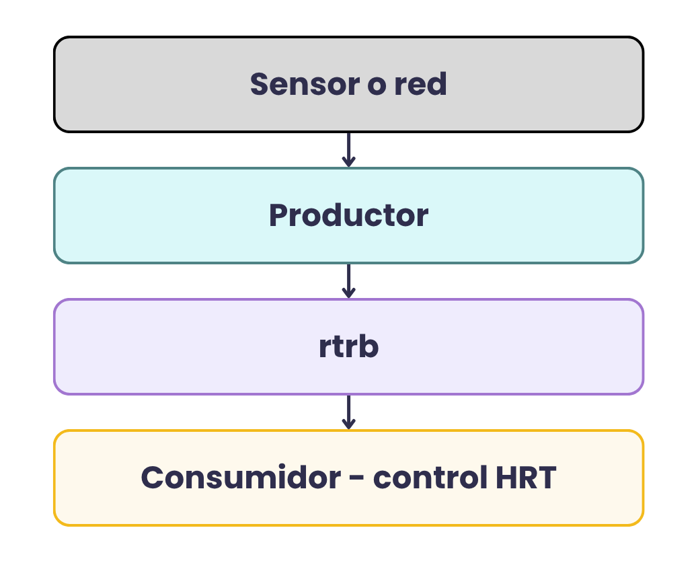

En la imágen, el bloque “Sensor o red” representa la fuente de los datos. Por ejemplo, podría ser un sensor que genera mediciones o una interfaz de red que recibe información. El “Productor” es el hilo o tarea encargada de recibir esos datos y escribirlos dentro del `rtrb`. El `rtrb` funciona entonces como una zona intermedia de comunicación. El productor puede ir depositando datos allí mientras el otro lado los recoge. Finalmente, “Control HRT” representa el consumidor. Ese hilo real-time lee los datos disponibles en el buffer y los utiliza para ejecutar su lógica crítica, por ejemplo calcular una acción de control.

Lo importante a destacar es que el productor y el hilo HRT quedan desacoplados. Así, el hilo HRT no tiene que esperar necesariamente a que el productor le entregue un dato mediante una operación bloqueante. Puede consultar el buffer y procesar lo que esté disponible.


> [!NOTE]
> 
> 
> `rtrb` está pensado específicamente para una arquitectura **SPSC**. Si existen varios productores o varios consumidores, se necesita otra estructura o una organización diferente de los threads.
> 

---

**`crossbeam-channel`**

`crossbeam-channel` es una opción muy útil para comunicación concurrente y puede ofrecer un rendimiento elevado. Sin embargo, **alto rendimiento no significa automáticamente comportamiento Hard Real-Time**.

Por ello, en una ruta crítica HRT suele ser más sencillo justificar estructuras con propiedades temporales más explícitas, como un ring buffer SPSC *wait-free*.

> [!IMPORTANT]
> 
> 
> En comunicación entre threads para HRT, el objetivo no es únicamente que el mecanismo sea rápido, sino que **su peor tiempo de espera sea conocido o suficientemente acotado**.
> 


## Arquitectura híbrida

En un servidor Rust con requisitos Hard Real-Time no es necesario que toda la aplicación funcione bajo restricciones temporales estrictas. Una estrategia habitual consiste en separar las operaciones críticas, que deben cumplir *deadlines*, de las tareas generales del sistema.

Una arquitectura típica puede organizarse así:

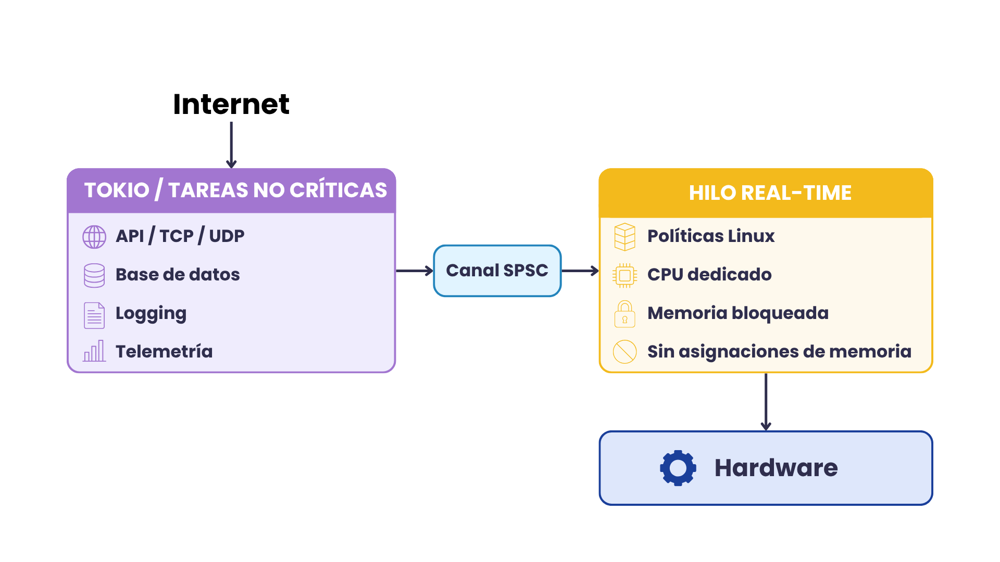

En la parte no crítica pueden ejecutarse tareas como networking, HTTP, WebSocket, acceso a bases de datos, logging o telemetría. Para este tipo de trabajo puede utilizarse, por ejemplo, Tokio, un runtime asíncrono orientado a manejar muchas operaciones concurrentes, aunque no proporciona por sí mismo garantías Hard Real-Time.

Por separado, uno o varios hilos real-time se encargan de las operaciones que sí tienen restricciones temporales estrictas. Estos pueden configurarse mediante políticas como `SCHED_FIFO`, `SCHED_RR` o `SCHED_DEADLINE`, afinidad de CPU, memoria preparada previamente y mecanismos de comunicación cuyo comportamiento temporal pueda mantenerse bajo control.

Ambas partes pueden intercambiar información mediante mecanismos de comunicación adecuados, como un canal SPSC. De esta forma, las operaciones generales permanecen desacopladas del camino crítico y se reduce su interferencia sobre los hilos real-time.

Finalmente, los hilos críticos pueden interactuar con el hardware directamente o mediante drivers e interfaces proporcionadas por Linux.

> [!IMPORTANT]
> 
> 
> **El objetivo no es convertir todo el servidor en Hard Real-Time,** solo las partes que realmente tienen *deadlines* estrictos necesitan ejecutarse bajo condiciones real-time. El resto del sistema puede continuar utilizando herramientas convencionales como Tokio.
> 

---

# Referencias

<a id="ref-1"></a>
[1] IEEE, “Real-time systems,” *IEEE Technology Navigator*. [Online]. Available: [https://technav.ieee.org/topic/real-time-systems/](https://technav.ieee.org/topic/real-time-systems/). [Accessed: Aug. 25, 2026].

<a id="ref-2"></a>
[2] *Rust From Zero To Hero*, “Deterministic Firmware with RTIC: Guaranteeing Hard Deadlines.” [Online]. Available: [https://rustz2h.com/chapter_14_rust_systems_and_embedded_programming/series_03_realtime_and_concurrency_embedded/deterministic_firmware](https://rustz2h.com/chapter_14_rust_systems_and_embedded_programming/series_03_realtime_and_concurrency_embedded/deterministic_firmware). [Accessed: Aug. 25, 2026].

<a id="ref-3"></a>
[3] The Rust Project Developers, “The `no_std` attribute,” *Rust Documentation*. [Online]. Available: [https://doc.rust-lang.org/core/attribute.no_std.html](https://doc.rust-lang.org/core/attribute.no_std.html). [Accessed: Aug. 25, 2026].

<a id="ref-4"></a>
[4] The Rust Project Developers, “Platform Support,” *The rustc book*. [Online]. Available: [https://doc.rust-lang.org/rustc/platform-support.html](https://doc.rust-lang.org/rustc/platform-support.html). [Accessed: Aug. 25, 2026].

<a id="ref-5"></a>
[5] RTIC Developers, “Real-Time Interrupt-driven Concurrency — The hardware accelerated Rust RTOS,” *RTIC Book*. [Online]. Available: [https://rtic.rs/2/book/en/](https://rtic.rs/2/book/en/). [Accessed: Aug. 25, 2026].

<a id="ref-6"></a>
[6] Embassy Project, “embassy-executor — an async/await executor designed for embedded usage,” *Embassy Documentation*. [Online]. Available: [https://docs.embassy.dev/embassy-executor/](https://docs.embassy.dev/embassy-executor/). [Accessed: Aug. 25, 2026].

<a id="ref-7"></a>
[7] Linux Kernel Developers, “Lock types and their rules,” *The Linux Kernel Documentation*, 2026, [Online]. Available: [https://docs.kernel.org/locking/locktypes.html](https://docs.kernel.org/locking/locktypes.html).

<a id="ref-8"></a>
[8] Linux Kernel Developers, “Deadline Task Scheduling,” *The Linux Kernel Documentation*, 2026, [Online]. Available: [https://docs.kernel.org/scheduler/sched-deadline.html](https://docs.kernel.org/scheduler/sched-deadline.html).

<a id="ref-9"></a>
[9] RoboPLC Project, “RoboPLC — Framework for PLCs and real-time micro-services,” *RoboPLC Documentation*, 2026, [Online]. Available: [https://info.bma.ai/en/actual/roboplc/](https://info.bma.ai/en/actual/roboplc/).

<a id="ref-10"></a>
[10] Xenomai Project, “Xenomai 3 documentation,” *Xenomai Documentation*, [Online]. Available: [https://doc.xenomai.org/](https://doc.xenomai.org/).

<a id="ref-11"></a>
[11] `thread-priority` Project, “thread_priority — Library for changing thread priority and scheduling policy,” *Docs.rs*, 2026, [Online]. Available: [https://docs.rs/thread-priority/latest/thread_priority/](https://docs.rs/thread-priority/latest/thread_priority/).

<a id="ref-12"></a>
[12] `rtrb` Project, “Real-Time Ring Buffer,” *Docs.rs*, 2026, [Online]. Available: [https://docs.rs/rtrb/latest/rtrb/](https://docs.rs/rtrb/latest/rtrb/).

<a id="ref-13"></a>
[13] Tokio Project, “tokio::runtime — The Tokio runtime,” *Tokio API Documentation*, 2026, [Online]. Available: [https://docs.rs/tokio/latest/tokio/runtime/](https://docs.rs/tokio/latest/tokio/runtime/).

<a id="ref-14"></a>
[14] M. Kerrisk and Linux man-pages contributors, “mlock, mlock2, mlockall, munlock, munlockall — lock and unlock memory,” *Linux man-pages*, 2026, [Online]. Available: [https://man7.org/linux/man-pages/man2/mlock.2.html](https://man7.org/linux/man-pages/man2/mlock.2.html).
