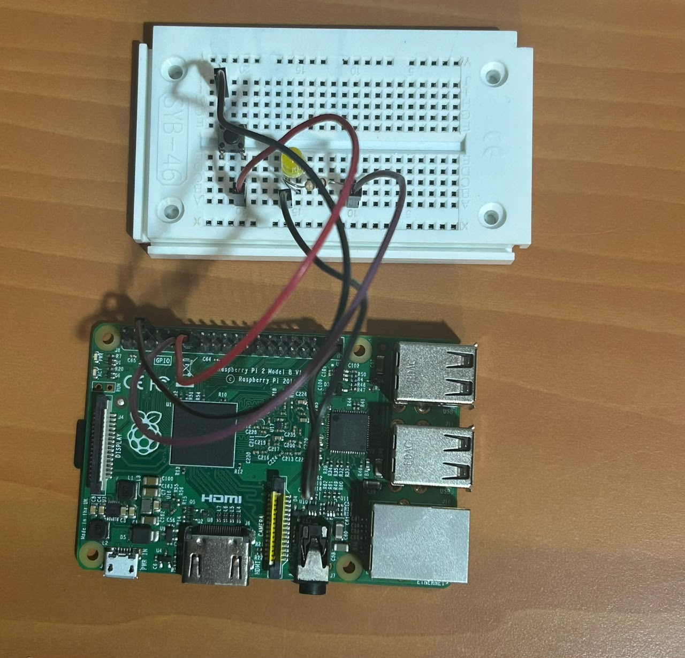
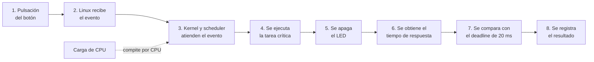
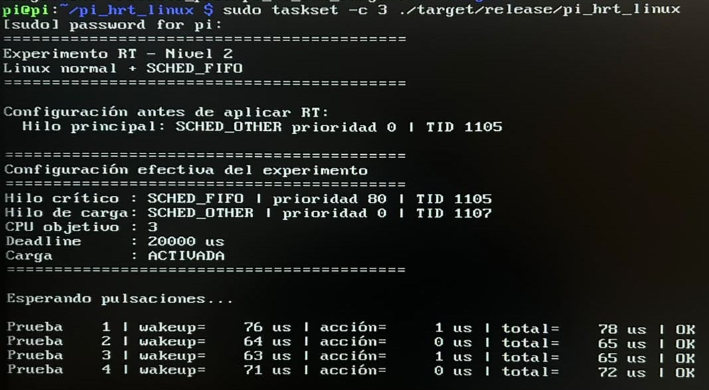

# Linux PREEMPT_RT - Raspberry Pi

# Contexto del proyecto

el proyecto se basa en un experimento de respuesta temporal sobre una Raspberry Pi 2. Específicamente, se estudia cuánto tiempo transcurre entre un evento de entrada generado por un pulsador y la ejecución de una respuesta observable sobre un LED. El programa registra esa latencia y la compara con un deadline experimental de **20 ms**. Al repetir la prueba sin carga y con carga artificial de CPU se busca observar cómo la planificación, la prioridad y el modelo de desalojo (*preemption*) del kernel afectan la capacidad de respuesta.


## Hardware utilizado

Para el experimento, se usaron los siguientes elementos:

- Raspberry Pi 2 Model B Rev 1.1, con CPU ARMv7, sistema de 32 bits y cuatro núcleos
- Tarjeta microSD (que contiene S.O de la Raspberry pi)
- LED
- Resistencia de `220 ohm`
- Pulsador
- Protoboard
- Cables de conexión

## Configuración del hardware

La siguiente imagen muestra como fueron conectados los cables a tanto a la Raspberry Pi como la configuración del protoboard




## Arquitectura general del experimento

El siguiente diagrama representa el flujo general del experimento desde que ocurre el evento físico hasta que se registra el resultado de la prueba



La idea es observar cuánto tarda el sistema en reaccionar ante una entrada y cómo esa respuesta puede verse afectada por la carga del procesador.

Cuando el usuario **pulsa el botón**, el sistema operativo detecta el cambio en la entrada GPIO y genera un evento. A partir de ahí, el **kernel y el scheduler** se encargan de procesarlo y decidir cuándo puede ejecutarse el hilo responsable de atenderlo. Cuando ese hilo obtiene tiempo de CPU, se ejecuta la **tarea crítica**, cuya acción principal es apagar el LED.

Una vez realizada esa acción, el programa calcula el **tiempo de respuesta**, es decir, cuánto transcurrió desde que el sistema operativo registró el evento del botón hasta que se ejecutó la respuesta asociada. Ese valor se compara con el **deadline de 20 ms** definido para el experimento. Finalmente, el resultado se registra indicando la latencia medida y si el deadline se cumplió o no.

Al mismo tiempo, puede existir una **carga artificial de CPU** ejecutando cálculos continuamente. Su función es competir por tiempo de procesador y crear una condición más exigente. Esto permite analizar cómo responde el sistema cuando la tarea crítica debe ejecutarse mientras el procesador también está ocupado con otro trabajo.

# Pasos

Esta sección muestra los pasos seguidos para ejecutar el experimento. Puede dividirse principalmente en dos fases: 

- La elaboración del programa en Rust
- La configuración de Linux PREEMPT_RT en la Raspberry Pi

Este documento se centra especialmente en la parte de configuración de Linux PREEMPT_RT en la Raspberry Pi.

## Programa en Rust

### Tecnologías y herramientas

- Rust.
- Cargo.
- crate `libc = "0.2"`.
- APIs POSIX `pthread_*` mediante `libc`.

### Configuración del proyecto en Rust

**Estructura del proyecto**

```
pi_hrt_linux/
├── Cargo.toml
├── Cargo.lock
└── src/
    ├── main.rs
    └── scheduler.rs
```

Sus responsabilidades principales son:

- configurar GPIO
- esperar el botón
- controlar el LED
- crear la carga artificial
- leer `CLOCK_MONOTONIC`
- calcular `T0`, `T1`, `T2`
- comparar con el deadline
- registrar cada ensayo en CSV

`Cargo.toml`

```toml
[package]
name = "pi_hrt_linux"
version = "0.1.0"
edition = "2021"

[dependencies]
libc = "0.2"
rppal = "0.22"
```

El código completo de los archivos `main.rs` y `scheduler.rs` se encuentran en el Anexo A. 

## Configuración de Linux PREEMPT_RT

El objetivo fue arrancar la Raspberry Pi con un kernel Linux que tuviera:

```
CONFIG_PREEMPT_RT=y
```

para poder comparar experimentalmente su comportamiento temporal

### Estado inicial

Antes de comenzar se verificó el sistema que estaba instalado.

A continuación, se muestran los comandos usados y su resultado. Estos comandos específicamente permitieron identificar el kernel actual, sistema operativo, número de CPUs y la arquitectura y modelo de la Raspberry Pi. 

| Comando | Resultado |
|---|---|
| `uname -a` | <pre><code>Linux pi 6.18.34+rpt-rpi-v7 #1 SMP Raspbian 1:6.18.34-1+rpt1 (2026-06-09)<br>armv7l GNU/Linux</code></pre> |
| `uname -r` | <pre><code>6.18.34+rpt-rpi-v7</code></pre> |
| `cat /etc/os-release` | <pre><code>PRETTY_NAME="Raspbian GNU/Linux 13 (trixie)"<br>NAME="Raspbian GNU/Linux"<br>VERSION_ID="13"<br>VERSION="13 (trixie)"<br>VERSION_CODENAME=trixie<br>DEBIAN_VERSION_FULL=13.4</code></pre> |
| `nproc` | <pre><code>4</code></pre> |
| `cat /proc/cpuinfo \| grep -E 'model name\|Hardware\|Revision\|Model'` | <pre><code>model name : ARMv7 Processor rev 5 (v7l)<br>model name : ARMv7 Processor rev 5 (v7l)<br>model name : ARMv7 Processor rev 5 (v7l)<br>model name : ARMv7 Processor rev 5 (v7l)<br>Hardware : BCM2835<br>Revision : a01041<br>Model : Raspberry Pi 2 Model B Rev 1.1</code></pre> |
| `getconf LONG_BIT` | <pre><code>32</code></pre> |

Por tanto, el procedimiento se realizó específicamente para:

```
Raspberry Pi 2 Model B Rev 1.1 
ARMv7 
32 bits
```

### Comprobación del kernel original

Antes de intentar instalar PREEMPT_RT se comprobó qué modelo de interrupción (*preemption*) utilizaba el kernel original.

Se ejecutó:

```bash
grep -E 'CONFIG_PREEMP(_RT||DYNAMIC)?=' /boot/config-$(uname -r)
```

No apareció una configuración RT.

También se intentó:

```bash
zcat /proc/config.gz | grep -E 'CONFIG_PREEMPT(_RT|DYNAMIC)?='
```

pero el sistema respondió:

```
gzip: /proc/config.gz: No such file or directory
```

Posteriormente se utilizó:

```bash
grep PREEMPT /boot/config-$(uname -r) 2>/dev/null
```

Resultado:

```bash
CONFIG_PREEMPT_VOLUNTARY_BUILD=y
# CONFIG_PREEMPT_NONE is not set
CONFIG_PREEMPT_VOLUNTARY=y
# CONFIG_PREEMPT is not set
# CONFIG_PREEMPTIRQ_DELAY_TEST is not set
```

Por tanto, el kernel original utilizaba:

```bash
CONFIG_PREEMPT_VOLUNTARY=y
```

y no:

```bash
CONFIG_PREEMPT_RT=y
```

### Primer intento: utilizar el kernel 6.18

Inicialmente se intentó trabajar sobre la rama moderna del kernel Raspberry Pi 6.18.

El problema fue que la Raspberry Pi utilizada era ARM32:

```
ARCH=arm
```

y la configuración del kernel no permitía habilitar PREEMPT_RT para esa arquitectura.

se comprobó:

```bash
grep -n "CONFIG_ARCH_SUPPORTS_RT" arch/arm64/Kconfig
```

y:

```bash
grep -n "CONFIG_ARCH_SUPPORTS_RT" arch/arm/Kconfig
```

Finalmente:

```bash
grep -R "select ARCH_SUPPORTS_RT" -n arch/arm arch/arm64 2>/dev/null
```

produjo:

```
arch/arm64/Kconfig:110:	select ARCH_SUPPORTS_RT
```

Esto fue importante porque mostró que la selección de soporte RT estaba presente para ARM64, pero no para el ARM32 que utilizaba la Raspberry Pi 2.

Por lo anterior, se decidió utilizar otra rama de kernel que ya incorporara PREEMPT_RT y que pudiera utilizarse con la Raspberry Pi 2 ARM32.

### Segundo intento: kernel Raspberry Pi 5.15 RT

Se utilizó el repositorio:

```
BlokasLabs/rpi-linux-rt
```

y específicamente la rama:

```
blokas-rpi-5.15.y-rt
```

El repositorio es un fork del kernel de Raspberry Pi y esa rama contiene el trabajo RT sobre Linux 5.15. La propia rama identifica Linux `5.15.36`, y su historial incluye cambios descritos como aplicación del parche RT 5.15.


No se descargó un parche independiente para aplicarlo manualmente.

**Dependencias de compilación**

Durante el proceso se instalaron las herramientas necesarias para configurar y compilar el kernel.

Entre ellas estuvieron:

```bash
sudo apt install -y \
    git \
    build-essential \
    bc \
    bison \
    flex \
    libssl-dev \
    libncurses-dev \
    dwarves \
    pkg-config
```

**Descarga del kernel RT**

Se trabajó desde el directorio personal `cd ~` .  El árbol se descargó como `~/linux-rt-5.15` y la rama utilizada fue `blokas-rpi-5.15.y-rt`

El comando de clonación para esta rama en específico fue:

```bash
git clone --depth=1 \
    --branch blokas-rpi-5.15.y-rt \
    https://github.com/BlokasLabs/rpi-linux-rt.git \
    linux-rt-5.15
```

Esta rama ya contiene una integración del parche PREEMPT_RT sobre un árbol Raspberry Pi 5.15, por lo que se evita tener que encontrar y aplicar manualmente un parche que coincida exactamente con el kernel.

Después:

```bash
cd ~/linux-rt-5.15
```

**Configuración para Raspberry Pi 2**

La Raspberry Pi 2 utiliza un kernel ARM de 32 bits.

Se establecieron:

```bash
export ARCH=arm
export KERNEL=kernel7
```

Para Raspberry Pi 2, la configuración base correspondiente es:

```bash
make bcm2709_defconfig
```

Esta elección coincide con la documentación de compilación de Raspberry Pi para Raspberry Pi 2 en modo 32-bit: `ARCH=arm`, `KERNEL=kernel7` y `bcm2709_defconfig`.

**Abrir la configuración del kernel y activar PREEMPT_RT**

Después de generar la configuración base:

```bash
make bcm2709_defconfig
```

se ejecutó:

```bash
make menuconfig
```

Esto abrió la interfaz de configuración del kernel.

Dentro de `menuconfig` se buscó la configuración relacionada con:

```
PREEMPT_RT
```

para verificar que sí fuera seleccionable la opción. El resultado fue

```bash
PREEMPT_RT [=n]
```

Desde el menú de búsqueda general se siguió la ruta `General setup` > `General setup` . Una vez dentro, se seleccionó `Fully Preemptible Kernel (Real-Time)` , verificando que quedar marcada. Después se guardó la configuración.

La comprobación se hizo mediante el comando

```bash
grep '^CONFIG_PREEMPT_RT=' .config
```

Resultado:

```bash
CONFIG_PREEMPT_RT=y
```

Esto confirma que el kernel que se estaba preparando para compilar tenía PREEMPT_RT activado.

**Configuración de `LOCALVERSION`**

En `menuconfig`se ingresó a la ruta `General setup` > `Local version - append to kernel release` y se reemplazó el valor encontrado por 

```bash
-majo
```

pero realmente se le peude poner cualquier nombre que funione como identificador. Después se guardó la configuración.

Esto se comprobó mediante:

```bash
grep CONFIG_LOCALVERSION .config
```

Resultado:

```bash
CONFIG_LOCALVERSION="-majo"
```

La intención era añadir un identificador reconocible al kernel personalizado.

La documentación de Raspberry Pi también recomienda utilizar `LOCALVERSION` para distinguir un kernel personalizado y evitar confusiones con los módulos de otros kernels.

Posteriormente se ejecutó

```bash
make kernelrelease
```

Aunque se produjo 5.15.36-rt41-v7+ cuando lo esperado era 5.15.36-rt41-majo, no se modificó manualmente el Makefile ni se forzó el nombre.

**Comprobación antes de compilar**

Antes de iniciar una compilación larga se comprobó:

```bash
grep '^CONFIG_PREEMPT_RT' .config
```

Resultado:

```bash
CONFIG_PREEMPT_RT=y
```

También:

```bash
grep '^CONFIG_LOCALVERSION' .config
```

Resultado:

```bash
CONFIG_LOCALVERSION="-majo"
```

Por tanto, la configuración estaba lista.

**Compilación**

Dado que la Raspberry Pi usada tenía cuatro CPUs., se usó el comando

```bash
make -j4 zImage modules dtbs
```

La compilación tardó bastante tiempo (5 horas aproximadamente). Aparecieron algunos warnings, pero finalmente el proceso terminó sin errores.

**Localización de `zImage`**

Después de la compilación se necesitaba encontrar la imagen generada.

Se utilizó:

```bash
find . -type f -name "zImage"
```

La ubicación correspondiente era:

```bash
arch/arm/boot/zImage
```

**Instalación de los módulos**

Una vez compilado el kernel se instalaron los módulos mediante:

```bash
sudo make modules_install
```

Esto instala los módulos bajo:

```bash
/lib/modules/
```

Se puede verificar con:

```bash
ls /lib/modules/
```

La idea es que los módulos del kernel RT queden separados de los módulos del kernel original.

**Instalación del kernel**

Para no sobrescribir directamente el kernel original, se utilizó un nombre diferente para el kernel RT.

La imagen compilada era:

```bash
arch/arm/boot/zImage
```

y se copió al área de arranque como un kernel diferenciado:

```bash
sudo cp arch/arm/boot/zImage \
    /boot/firmware/kernel7-rt515-majo.img
```

La nomenclatura utilizada fue:

```bash
kernel7-rt515-majo.img
```

El objetivo era mantener disponible el kernel original y poder identificar claramente el kernel RT.

**Device Tree de Raspberry Pi 2**

Para Raspberry Pi 2 se necesitaba también el Device Tree correspondiente.

El archivo relevante era `bcm2709-rpi-2-b.dtb`

Se localizó con:

```bash
find arch/arm/boot/dts \
    -name "bcm2709-rpi-2-b.dtb"
```

Se utilizó una copia diferenciada para el kernel RT:

```bash
sudo cp \
    "$(find arch/arm/boot/dts -name 'bcm2709-rpi-2-b.dtb' | head -n1)" \
    /boot/firmware/bcm2709-rpi-2-b-rt515.dtb
```

Esto permitió conservar también el Device Tree anterior.

**Respaldo de la configuración de arranque**

Antes de modificar `/boot/firmware/config.txt`

se hizo una copia:

```bash
sudo cp /boot/firmware/config.txt \
    /boot/firmware/config-before-rt515.txt
```

Esto es importante porque `config.txt` determina qué kernel y qué Device Tree utilizará el firmware al arrancar.

**Selección del kernel RT**

Se editó:

```bash
sudo nano /boot/firmware/config.txt
```

y se añadió la configuración para arrancar el kernel RT:

```
# ---- Experimento PREEMPT_RT ----
kernel=kernel7-rt515-majo.img
device_tree=bcm2709-rpi-2-b-rt515.dtb
```

Antes del reboot se verificó que los archivos existieran:

```bash
ls -lh /boot/firmware/kernel7-rt515-majo.img
```

y:

```bash
ls -lh /boot/firmware/bcm2709-rpi-2-b-rt515.dtb
```

También:

```bash
ls /lib/modules/
```

**Reinicio**

Con el kernel RT instalado y seleccionado se ejecutó `sudo reboot`

Cabe decir que después de reiniciar utilizando el kernel RT 5.15 se observó que ya no aparecía la interfaz gráfica; sin embargo, la Raspberry Pi continuó siendo utilizable para las pruebas mediante terminal.

**Verificación posterior al reinicio**

Después del reinicio se comprobó:

```bash
uname -a
```

y:

```bash
uname -r
```

El kernel esperado era:

```
5.15.36-rt41-v7+
```

La comprobación con `uname` confirmó qué kernel estaba ejecutando realmente la Raspberry Pi.

**Verificación de PREEMPT_RT**

La comprobación de configuración realizada durante la compilación fue:

```bash
grep '^CONFIG_PREEMPT_RT=' ~/linux-rt-5.15/.config
```

Resultado:

```bash
CONFIG_PREEMPT_RT=y
```

Esto confirmó que la opción estaba correctamente habilitada y el sistema estaba funcionando con ella. 

# Pruebas de ejecución

Una vez configurado el kernel, se compiló la aplicación en modo optimizado (en una ocasión con carga y en otra ocasión, sin carga):

```bash
cargo build --release
```

y se ejecutó específicamente en el core 3:

```bash
sudo taskset -c 3 ./target/release/pi_hrt_linux
```

Las pruebas imprimían resultados como el siguiente



---

 # Anexo A - código del programa

<details>
<summary> Aquí se encuentra el código de los archivos `src/main.rs` y `src/scheduler.rs` </summary>

Archivo `src/main.rs`

```rust
mod scheduler;

use rppal::gpio::{Gpio, Trigger};

use std::error::Error;
use std::fs::OpenOptions;
use std::hint::black_box;
use std::io::Write;
use std::sync::mpsc;
use std::thread;
use std::time::Duration;

// ----------------------------------------------------
// CONFIGURACIÓN DEL EXPERIMENTO
// ----------------------------------------------------

const LED_GPIO: u8 = 17;
const BUTTON_GPIO: u8 = 27;

// false -> prueba sin carga
// true  -> prueba con carga
const ENABLE_LOAD: bool = true;

const DEADLINE_US: u128 = 20_000;

const DEBOUNCE_MS: u64 = 50;
const REARM_DELAY_MS: u64 = 200;

// Prioridad del hilo crítico bajo SCHED_FIFO.
const RT_PRIORITY: i32 = 80;

// CPU utilizada mediante taskset.
const EXPERIMENT_CPU: u8 = 3;

// ----------------------------------------------------
// RELOJ MONOTÓNICO
// ----------------------------------------------------

fn monotonic_time() -> Duration {
    unsafe {
        let mut ts: libc::timespec =
            std::mem::zeroed();

        let result = libc::clock_gettime(
            libc::CLOCK_MONOTONIC,
            &mut ts,
        );

        if result != 0 {
            panic!(
                "Error al leer CLOCK_MONOTONIC: {}",
                std::io::Error::last_os_error()
            );
        }

        Duration::new(
            ts.tv_sec as u64,
            ts.tv_nsec as u32,
        )
    }
}

// ----------------------------------------------------
// DIFERENCIA ENTRE TIMESTAMPS
// ----------------------------------------------------

fn difference_us(
    later: Duration,
    earlier: Duration,
) -> u128 {
    later
        .checked_sub(earlier)
        .unwrap_or(Duration::ZERO)
        .as_micros()
}

// ----------------------------------------------------
// CARGA ARTIFICIAL
// ----------------------------------------------------

fn load_task() -> ! {
    let mut value: u32 = 0;

    loop {
        for i in 0..50_000u32 {
            value = value
                .wrapping_shl(5)
                ^ value.wrapping_shr(3)
                ^ i;
        }

        black_box(value);
    }
}

// ----------------------------------------------------
// PROGRAMA PRINCIPAL
// ----------------------------------------------------

fn main() -> Result<(), Box<dyn Error>> {

    println!("==========================================");
    println!("Experimento RT - Nivel 2");
    println!("Linux normal + SCHED_FIFO");
    println!("==========================================");
    println!();

    // ------------------------------------------------
    // 1. CONFIGURACIÓN GPIO
    // ------------------------------------------------

    let gpio = Gpio::new()?;

    let mut led = gpio
        .get(LED_GPIO)?
        .into_output();

    let mut button = gpio
        .get(BUTTON_GPIO)?
        .into_input_pullup();

    led.set_high();

    button.set_interrupt(
        Trigger::FallingEdge,
        Some(Duration::from_millis(
            DEBOUNCE_MS
        )),
    )?;

    // ------------------------------------------------
    // 2. CREACIÓN DEL CSV
    // ------------------------------------------------

    let mut file = OpenOptions::new()
        .create(true)
        .write(true)
        .truncate(true)
        .open("results.csv")?;

    writeln!(
        file,
        "trial,event_to_wakeup_us,wakeup_to_led_us,event_to_led_us,deadline_us,miss"
    )?;

    // ------------------------------------------------
    // 3. CREAR HILO DE CARGA
    // ------------------------------------------------
    //
    // IMPORTANTE:
    //
    // El hilo de carga debe permanecer SCHED_OTHER.
    //
    // Por eso lo creamos y configuramos ANTES de
    // convertir el hilo principal a SCHED_FIFO.
    //
    // Además, dentro del propio hilo lo forzamos
    // explícitamente a SCHED_OTHER.
    // ------------------------------------------------

    let mut load_scheduler_info = None;

    if ENABLE_LOAD {
        let (tx, rx) = mpsc::channel();

        thread::Builder::new()
            .name("load_task".to_string())
            .spawn(move || {

                let result =
                    scheduler::set_current_thread_other();

                match result {
                    Ok(info) => {
                        // Informamos al hilo principal que
                        // la política fue configurada y
                        // verificada correctamente.
                        let _ = tx.send(Ok(info));

                        // A partir de aquí este hilo queda
                        // ocupado realizando cálculos.
                        load_task();
                    }

                    Err(error) => {
                        let _ = tx.send(
                            Err(error.to_string())
                        );
                    }
                }
            })?;

        // Esperamos confirmación antes de continuar.
        match rx.recv()? {
            Ok(info) => {
                load_scheduler_info = Some(info);
            }

            Err(error) => {
                return Err(format!(
                    "No fue posible configurar \
                     el hilo de carga: {}",
                    error
                )
                .into());
            }
        }
    }

    // ------------------------------------------------
    // 4. VER POLÍTICA ORIGINAL DEL HILO PRINCIPAL
    // ------------------------------------------------

    let before =
        scheduler::current_thread_info()?;

    println!("Configuración antes de aplicar RT:");
    println!(
        "  Hilo principal: {} prioridad {} | TID {}",
        scheduler::policy_name(before.policy),
        before.priority,
        before.tid
    );

    println!();

    // ------------------------------------------------
    // 5. CONVERTIR SOLAMENTE EL HILO PRINCIPAL
    //    A SCHED_FIFO
    // ------------------------------------------------

    let critical_info =
        match scheduler::set_current_thread_fifo(
            RT_PRIORITY
        ) {
            Ok(info) => info,

            Err(error) => {
                eprintln!(
                    "ERROR: no fue posible aplicar \
                     SCHED_FIFO."
                );

                eprintln!(
                    "Detalle: {}",
                    error
                );

                eprintln!();

                eprintln!(
                    "Ejecuta el programa con:"
                );

                eprintln!(
                    "sudo taskset -c {} \
                     ./target/release/pi_hrt_linux",
                    EXPERIMENT_CPU
                );

                return Err(error.into());
            }
        };

    // ------------------------------------------------
    // 6. MOSTRAR CONFIGURACIÓN REAL
    // ------------------------------------------------

    println!("==========================================");
    println!("Configuración efectiva del experimento");
    println!("==========================================");

    println!(
        "Hilo crítico : {} | prioridad {} | TID {}",
        scheduler::policy_name(
            critical_info.policy
        ),
        critical_info.priority,
        critical_info.tid
    );

    if let Some(info) = load_scheduler_info {
        println!(
            "Hilo de carga: {} | prioridad {} | TID {}",
            scheduler::policy_name(info.policy),
            info.priority,
            info.tid
        );
    } else {
        println!(
            "Hilo de carga: DESACTIVADO"
        );
    }

    println!(
        "CPU objetivo : {}",
        EXPERIMENT_CPU
    );

    println!(
        "Deadline     : {} us",
        DEADLINE_US
    );

    println!(
        "Carga        : {}",
        if ENABLE_LOAD {
            "ACTIVADA"
        } else {
            "DESACTIVADA"
        }
    );

    println!("==========================================");
    println!();

    println!("Esperando pulsaciones...");
    println!();

    // ------------------------------------------------
    // 7. BUCLE DEL EXPERIMENTO
    // ------------------------------------------------

    let mut trial: u64 = 0;

    loop {

        // ------------------------------------------------
        // El hilo SCHED_FIFO queda BLOQUEADO aquí.
        //
        // Mientras no haya botón, no consume CPU.
        // El hilo SCHED_OTHER de carga puede ejecutarse.
        // ------------------------------------------------

        let event =
            match button.poll_interrupt(
                false,
                None
            )? {
                Some(event) => event,
                None => continue,
            };

        // ================================================
        // INICIO DEL CAMINO CRÍTICO
        // ================================================

        // T0:
        // timestamp asociado al evento GPIO.
        let t_event = event.timestamp;

        // T1:
        // instante en que el hilo SCHED_FIFO
        // recuperó efectivamente la CPU.
        let t_wakeup = monotonic_time();

        // Acción crítica.
        led.set_low();

        // T2:
        // instante inmediatamente posterior
        // a la orden de apagar el LED.
        let t_led = monotonic_time();

        // ================================================
        // FIN DEL CAMINO CRÍTICO
        // ================================================

        trial += 1;

        let event_to_wakeup_us =
            difference_us(
                t_wakeup,
                t_event
            );

        let wakeup_to_led_us =
            difference_us(
                t_led,
                t_wakeup
            );

        let event_to_led_us =
            difference_us(
                t_led,
                t_event
            );

        let missed =
            event_to_led_us > DEADLINE_US;

        // ------------------------------------------------
        // Todo el logging ocurre DESPUÉS de T2.
        // ------------------------------------------------

        println!(
            "Prueba {:4} | wakeup={:6} us | acción={:6} us | total={:6} us | {}",
            trial,
            event_to_wakeup_us,
            wakeup_to_led_us,
            event_to_led_us,
            if missed {
                "DEADLINE INCUMPLIDO"
            } else {
                "OK"
            }
        );

        writeln!(
            file,
            "{},{},{},{},{},{}",
            trial,
            event_to_wakeup_us,
            wakeup_to_led_us,
            event_to_led_us,
            DEADLINE_US,
            if missed { 1 } else { 0 }
        )?;

        file.flush()?;

        // ------------------------------------------------
        // ESPERAR A QUE EL BOTÓN SEA LIBERADO
        // ------------------------------------------------

        while button.is_low() {
            thread::sleep(
                Duration::from_millis(1)
            );
        }

        // Retardo antes de rearmar.
        thread::sleep(
            Duration::from_millis(
                REARM_DELAY_MS
            )
        );

        led.set_high();
    }
}
```


Archivo s`rc/scheduler.rs`

```rust
use std::io;

#[derive(Debug, Clone, Copy)]
pub struct SchedulerInfo {
    pub policy: i32,
    pub priority: i32,
    pub tid: libc::pid_t,
}

pub fn policy_name(policy: i32) -> &'static str {
    match policy {
        libc::SCHED_OTHER => "SCHED_OTHER",
        libc::SCHED_FIFO => "SCHED_FIFO",
        libc::SCHED_RR => "SCHED_RR",
        libc::SCHED_BATCH => "SCHED_BATCH",
        libc::SCHED_IDLE => "SCHED_IDLE",
        _ => "DESCONOCIDA",
    }
}

fn current_tid() -> libc::pid_t {
    unsafe {
        libc::syscall(libc::SYS_gettid) as libc::pid_t
    }
}

pub fn current_thread_info() -> io::Result<SchedulerInfo> {
    unsafe {
        let thread = libc::pthread_self();

        let mut policy: i32 = 0;
        let mut param: libc::sched_param = std::mem::zeroed();

        let result = libc::pthread_getschedparam(
            thread,
            &mut policy,
            &mut param,
        );

        if result != 0 {
            return Err(io::Error::from_raw_os_error(result));
        }

        Ok(SchedulerInfo {
            policy,
            priority: param.sched_priority,
            tid: current_tid(),
        })
    }
}

pub fn set_current_thread_other() -> io::Result<SchedulerInfo> {
    unsafe {
        let thread = libc::pthread_self();

        let mut param: libc::sched_param = std::mem::zeroed();
        param.sched_priority = 0;

        let result = libc::pthread_setschedparam(
            thread,
            libc::SCHED_OTHER,
            &param,
        );

        if result != 0 {
            return Err(io::Error::from_raw_os_error(result));
        }
    }

    current_thread_info()
}

pub fn set_current_thread_fifo(priority: i32) -> io::Result<SchedulerInfo> {
    unsafe {
        let min_priority = libc::sched_get_priority_min(libc::SCHED_FIFO);

        if min_priority == -1 {
            return Err(io::Error::last_os_error());
        }

        let max_priority = libc::sched_get_priority_max(libc::SCHED_FIFO);

        if max_priority == -1 {
            return Err(io::Error::last_os_error());
        }

        if priority < min_priority || priority > max_priority {
            return Err(io::Error::new(
                io::ErrorKind::InvalidInput,
                format!(
                    "Prioridad RT {} fuera del rango {}..{}",
                    priority,
                    min_priority,
                    max_priority
                ),
            ));
        }

        let thread = libc::pthread_self();
        let mut param: libc::sched_param = std::mem::zeroed();
        param.sched_priority = priority;

        let result = libc::pthread_setschedparam(
            thread,
            libc::SCHED_FIFO,
            &param,
        );

        if result != 0 {
            return Err(io::Error::from_raw_os_error(result));
        }
    }

    let info = current_thread_info()?;

    if info.policy != libc::SCHED_FIFO || info.priority != priority {
        return Err(io::Error::new(
            io::ErrorKind::Other,
            format!(
                "El kernel no aplicó la configuración esperada. Política={}, prioridad={}",
                policy_name(info.policy),
                info.priority
            ),
        ));
    }

    Ok(info)
}
```

</details>


# Anexo B - Resumen de comandos

<details>
<summary>Aquí se encuentra un resumen de comandos para configurar Linux PREEMPT_RT</summary>

## Comprobar hardware

```bash
uname -a
uname -r
cat /etc/os-release
nproc
cat /proc/cpuinfo | grep -E 'model nam|Hardware|Revision|Model'
getconf LONG_BIT
```

Debe tratarse de una Raspberry Pi 2 ARMv7 de 32 bits.

## Comprobar espacio

```bash
df -h
```

## Instalar dependencias

```bash
sudo apt update

sudo apt install -y \
    git \
    build-essential \
    bc \
    bison \
    flex \
    libssl-dev \
    libncurses-dev \
    dwarves \
    pkg-config
```

## Descargar el kernel RT

```bash
cd ~

git clone --depth=1 \
    --branch blokas-rpi-5.15.y-rt \
    https://github.com/BlokasLabs/rpi-linux-rt.git \
    linux-rt-5.15
```

## Entrar al kernel

```bash
cd ~/linux-rt-5.15
```

## Configurar Raspberry Pi 2

```bash
export ARCH=arm
export KERNEL=kernel7

make bcm2709_defconfig
```

## Abrir configuración

```bash
make menuconfig
```

Activar:

```
Fully Preemptible Kernel (Real-Time)
```

y configurar:

```
CONFIG_LOCALVERSION="-<nombre>"
```

## Verificar

```bash
grep '^CONFIG_PREEMPT_RT=' .config
```

Debe mostrar:

```bash
CONFIG_PREEMPT_RT=y
```

También:

```bash
grep '^CONFIG_LOCALVERSION' .config
```

## Comprobar release

```bash
make kernelrelease
```

Resultado obtenido:

```
5.15.36-rt41-v7+
```

## Compilar

```bash
make -j4 zImage modules dtbs
```

## Comprobar kernel generado

```bash
ls -lh arch/arm/boot/zImage
```

## Instalar módulos

```bash
sudo make modules_install
```

## Localizar Device Tree

```bash
find arch/arm/boot/dts \
    -name "bcm2709-rpi-2-b.dtb"
```

## Copiar kernel

```bash
sudo cp arch/arm/boot/zImage \
    /boot/firmware/kernel7-rt515-<nombre>.img
```

## Copiar Device Tree

```bash
sudo cp \
    "$(find arch/arm/boot/dts -name 'bcm2709-rpi-2-b.dtb' | head -n1)" \
    /boot/firmware/bcm2709-rpi-2-b-rt515.dtb
```

## Respaldar configuración

```bash
sudo cp /boot/firmware/config.txt \
    /boot/firmware/config-before-rt515.txt
```

## Seleccionar kernel RT

```bash
sudo nano /boot/firmware/config.txt
```

Añadir:

```bash
kernel=kernel7-rt515-<nombre>.img
device_tree=bcm2709-rpi-2-b-rt515.dtb
```

## Verificar archivos

```bash
ls -lh /boot/firmware/kernel7-rt515-<nombre>.img
ls -lh /boot/firmware/bcm2709-rpi-2-b-rt515.dtb
ls /lib/modules/
```

## Reiniciar

```bash
sudo reboot
```

## Verificar kernel arrancado

```bash
uname -a
uname -r
```

Debe aparecer:

```bash
5.15.36-rt41-v7+
```

</details>
